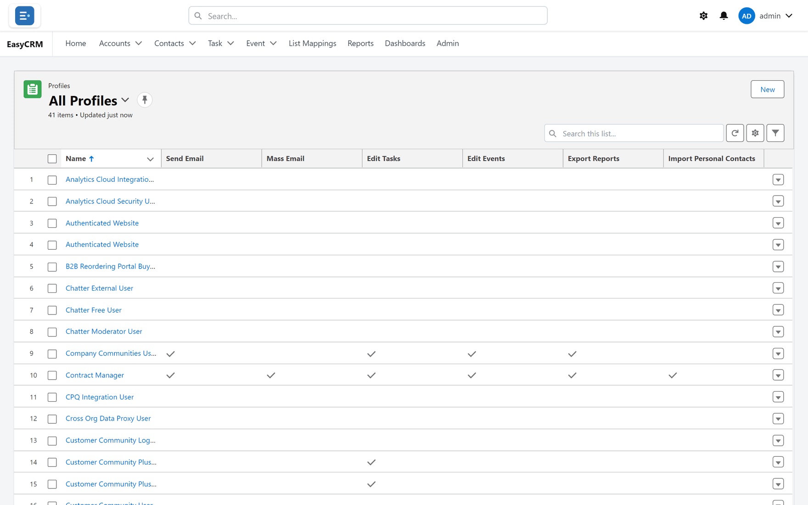

# What you can see

**What it is.** Your role, which decides what you can see and do in the portal.

**Why it matters.** Two people can open the same portal and see different tabs and different
records. That is not a fault — it is the role doing its job.

## The three roles

| Role | What they can do |
|---|---|
| **Standard** | See and work on their own records. Most people are this. |
| **Admin** | Everything a Standard user can, plus manage the people at their own company. |
| **Super Admin** | Everything, for every company. |

Your administrator chooses your role. You cannot change it yourself, and you cannot see what
somebody else's is unless you are an administrator.

## Finding out your own role

**Where:** your name (top right) → **Settings**

1. Click your name in the top right corner.
2. Click **Settings**.
3. Your role is shown with your other details.

## Why a tab might be missing

If a colleague has a tab you do not, one of these is true:

| Reason | Who can fix it |
|---|---|
| Your role does not include it. | Your administrator. |
| Your administrator has hidden it for your company. | Your administrator. |
| You have no permission for that kind of record. | Your administrator. |

The **Admin** tab, for example, only appears for Admins and Super Admins.

## Why a record might be missing

Seeing a tab is not the same as seeing every record in it. Two separate things decide that:

- **Permissions** — what you may do with records: read, create, edit, delete.
- **Sharing** — which records you may do it to.

You need both. If you can open **Accounts** but the list is empty, you have permission but no
sharing. Your administrator fixes that under
[Sharing](../administration/sharing.md).

If you think you should see something and do not, ask your administrator — they can check
exactly who has access and why, using
[Checking who can see a record](../administration/record-access.md).
