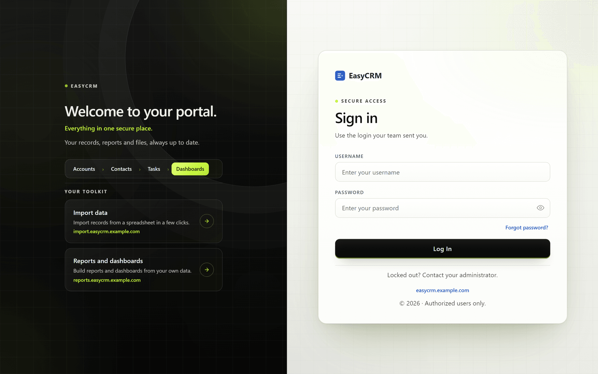
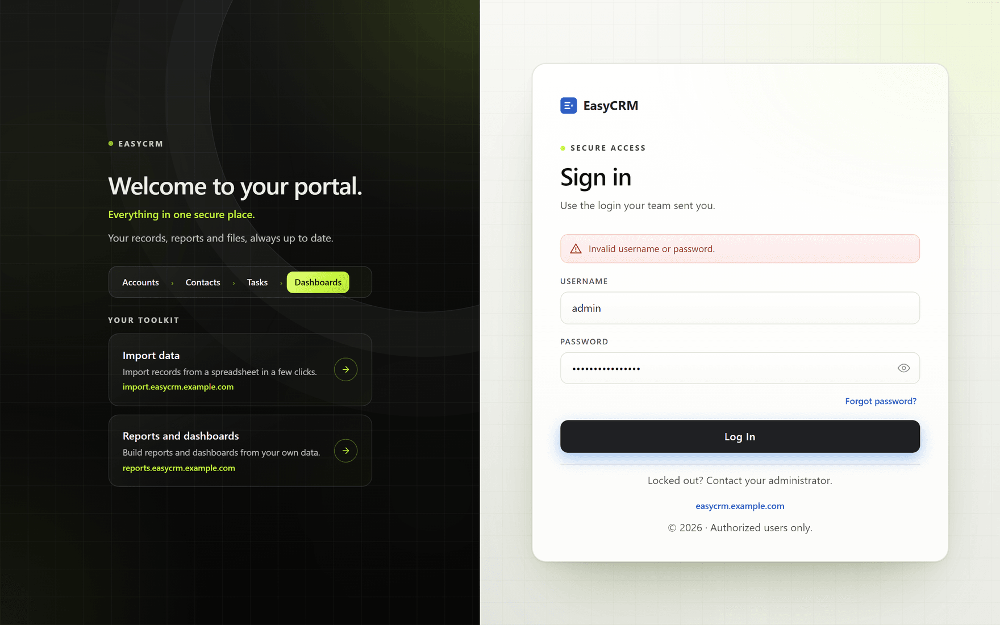
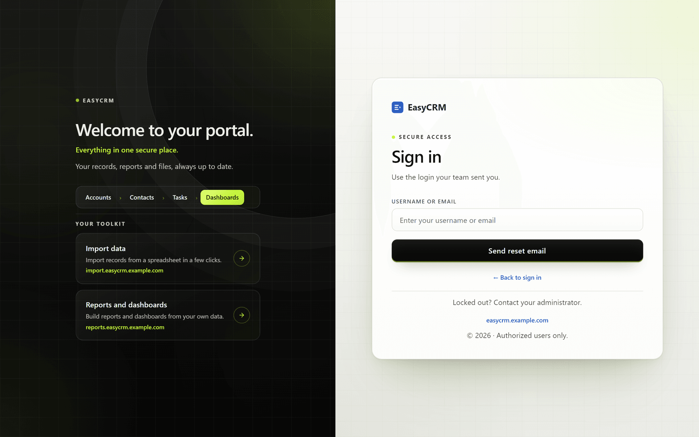

# Signing in

**What it is.** How you get into the portal.

**What you need.** A username and a password. Your administrator sends these to you by email
when your account is created.

**What you do not need.** Anything installed. The portal runs in your normal web browser —
Chrome, Edge, Firefox or Safari — on a computer, tablet or phone.

## Signing in for the first time

**Where:** the web address your administrator sent you

1. Open your web browser.
2. Type in the web address your administrator gave you, and press Enter.
3. The sign-in page opens. It has two halves: your company's picture on the left, and the
   sign-in box on the right.

   

4. Click the **Username** box and type your username.

   Your username is usually short, like `jsmith`. It is **not** your email address, unless
   your administrator set it up that way.

5. Click the **Password** box and type your password.

   The password is hidden as you type. Click the small eye symbol at the right of the box if
   you want to check what you have typed.

6. Click the black **Log In** button.

You are now on the home page.

## If your password does not work

A message appears in red above the boxes.

Nearly always it is one of these:

- A typing mistake. Click the eye symbol and check the password.
- **Caps Lock** is on. Passwords care about capital letters.
- An extra space at the start or end, from copying and pasting.

Try again carefully. If it still fails, use **Forgot password?** below.

## If you forget your password

**Where:** sign-in page → **Forgot password?**

1. On the sign-in page, click **Forgot password?** under the password box.
2. The page changes to ask for your username or email address.

   

3. Type your username, or the email address your account uses.
4. Click **Send reset email**.
5. Check your email. A new password arrives within a few minutes.
6. Go back to the sign-in page and sign in with the new password.

Then change it to something you will remember — see
[Changing your password](../your-account/password.md).

**If no email arrives**, check your spam folder first. If it is not there, your administrator
can set a new password for you directly.

## Signing out

**Where:** your name (top right) → **Log Out**

1. Click your name in the top right corner of the screen.
2. Click **Log Out**.

Always sign out on a shared or public computer.
