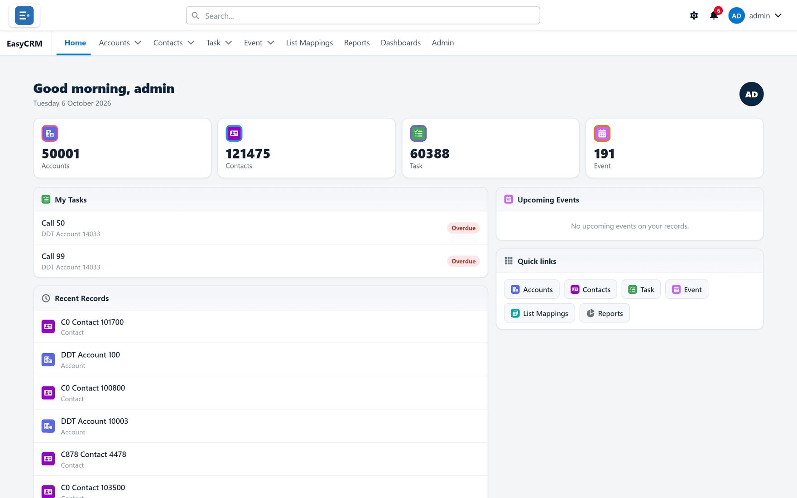
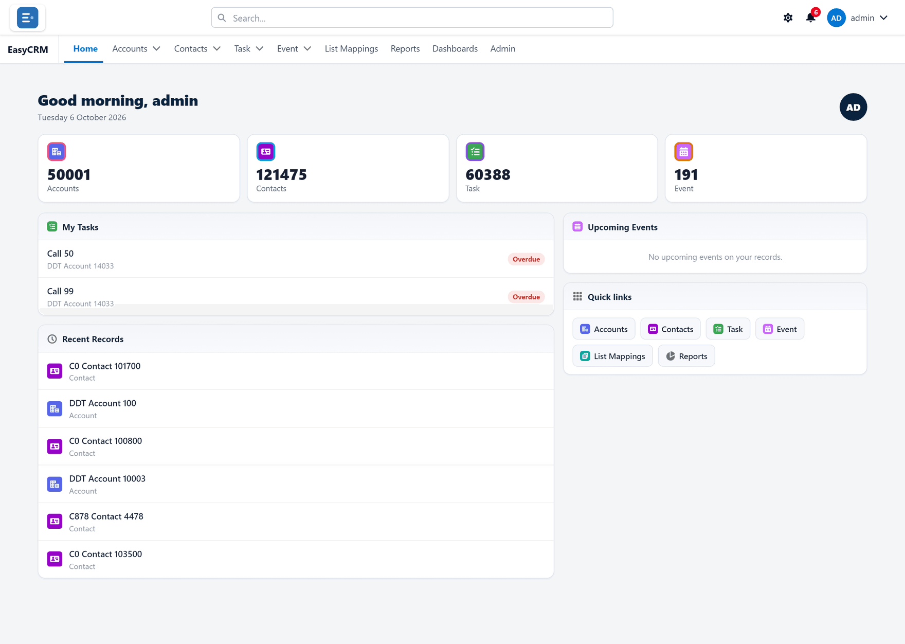
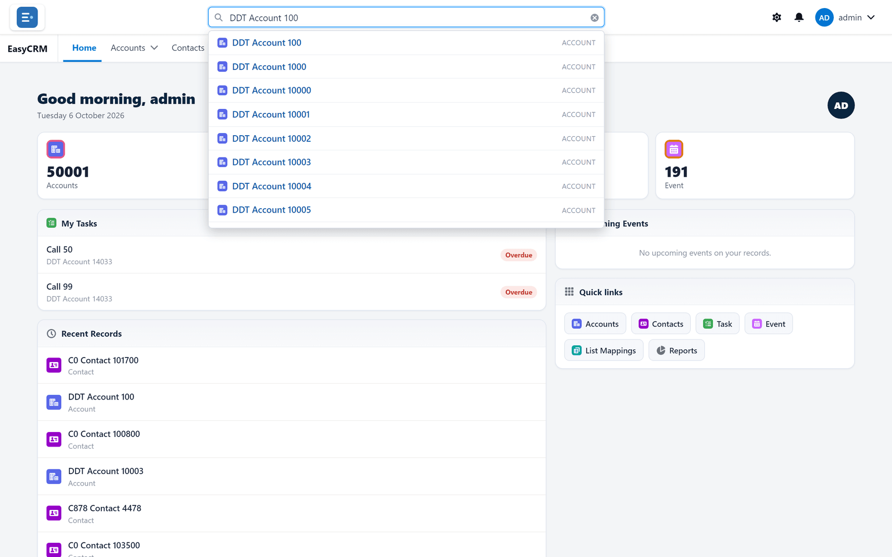
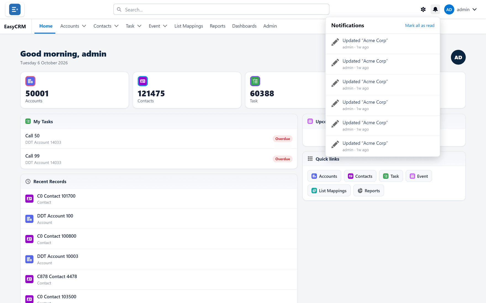
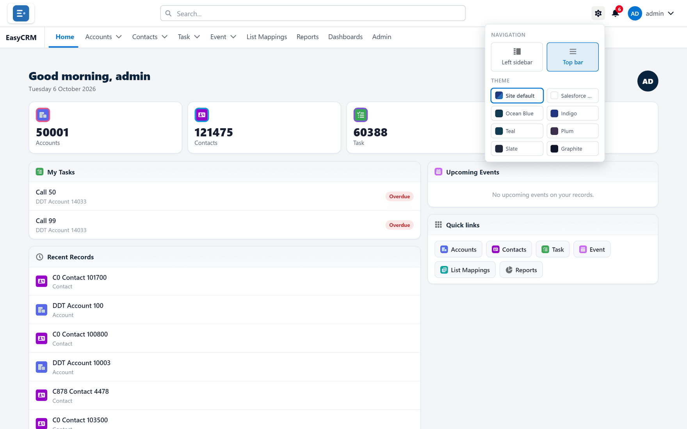
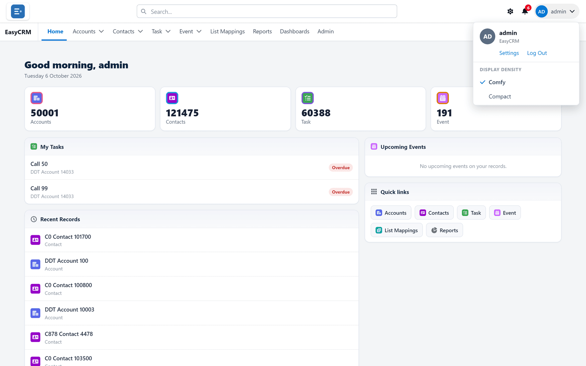

# Getting around

**What it is.** The bar across the top of the screen, which is the same on every page.

**Why it matters.** Once you know these few controls you can reach anything in the portal.
This is the one page worth reading properly before anything else.

## The two rows at the top

The very top row, from left to right:

| What you see | Where it is | What it does |
|---|---|---|
| Your company's logo | Far left | Takes you back to the home page. |
| **Search...** | Middle | Finds any record by name. |
| A gear symbol | Right | Changes how the portal looks **to you**. |
| A bell | Right | Your notifications. A red number means unread ones. |
| Your name | Far right | Settings, and **Log Out**. |

The second row is your **tabs**. These are the main sections — **Home**, then one tab per kind
of record (**Accounts**, **Contacts**, **Task**, **Event**), then **Reports**, **Dashboards**,
and **Admin** if you are an administrator.

The tab you are on is underlined in blue.

**Your tabs may not match this picture.** Your administrator chooses which tabs your company
sees, and your role affects it too. See [What you can see](./roles.md).

## The home page

The home page has four parts.

**The number tiles** across the top show how many records of each kind you can see. Click one
to open that list.

**My Tasks** lists tasks that are yours and not yet done. Anything past its due date is marked
**Overdue** in red.

**Recent Records** lists what you opened lately, newest first. This is usually the fastest way
back to something you were working on five minutes ago.

**Quick links** are shortcuts to each tab, the same as the tabs above.

Here is the whole page:

## Searching for anything

**Where:** **Search...** at the top → type → click a result

1. Click the **Search...** box in the middle of the top bar.
2. Start typing a name. You do not need the whole thing — a few letters is enough.
3. Results appear underneath as you type, grouped by kind of record.

   

4. Click a result to open it.

Search looks across every kind of record you are allowed to see, so it is the quickest way to
find something when you are not sure which tab it lives under.

## Your notifications

**Where:** the bell (top right)

1. Click the bell in the top right.
2. The list opens, newest first.

   

3. Click one to open what it refers to.

The red number on the bell is how many you have not read.

## Changing how the portal looks

**Where:** the gear (top right)

1. Click the gear symbol in the top right.
2. The panel opens.

   

3. Under **Navigation**, choose where the menu sits:
   - **Top bar** — tabs across the top, as in these pictures.
   - **Left sidebar** — tabs down the left side.
4. Under **Theme**, click a colour.
5. Click **Save**.

**This changes only what you see.** Nobody else is affected, and no data changes.

## Your account menu

**Where:** your name (top right)

1. Click your name in the top right.

   

2. From here you can reach:

| Item | What it does |
|---|---|
| **Settings** | Your profile and your password. |
| **Log Out** | Signs you out. |
| **Comfy** / **Compact** | How much space rows take up. **Compact** fits more on screen. |
