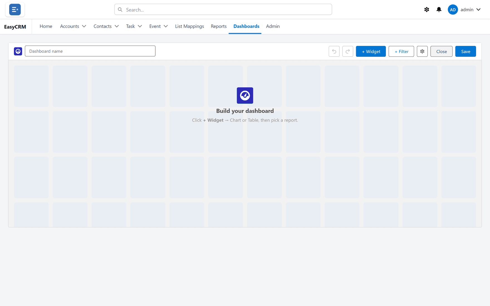

# Building a dashboard

1. Click **Dashboards**.
2. Click **New Dashboard**.

3. Click **Add** to put a tile on the page.
4. Choose a report for the tile to read from.
5. Choose how it should look.
6. Click **Save**, give it a name, and choose a folder.

## The kinds of tile

| Tile | Shows |
|---|---|
| **Metric** | One big number. |
| **Bar** / **Column** | Compares groups. |
| **Line** | A value over time. |
| **Pie** / **Donut** | Parts of a whole. |
| **Gauge** | Progress towards a target. |
| **Table** | Rows straight from the report. |

## Moving tiles

Drag a tile to move it. Drag its corner to resize it.

## Dashboard filters

Add a filter at the top so one choice changes every tile.

Each tile reads from a different report, so you tell the dashboard which field on each report
the filter matches. Fields with the same name are matched for you.
