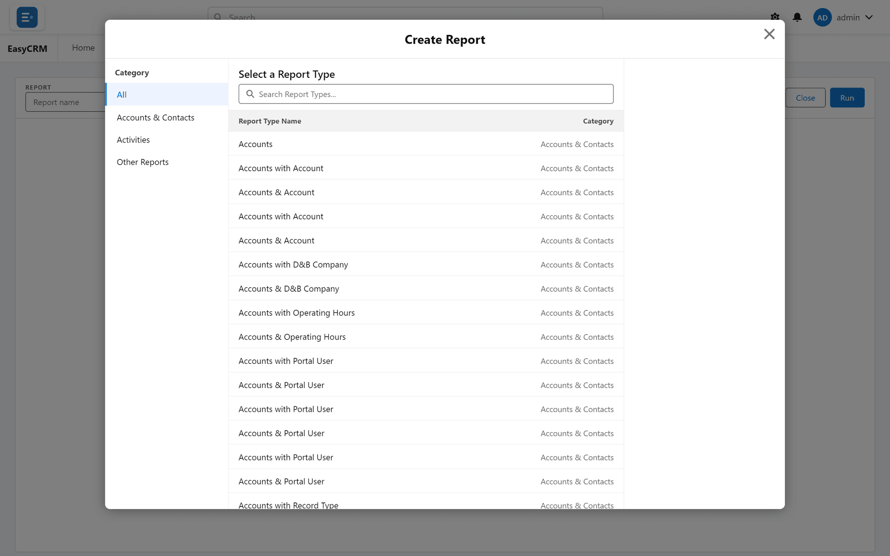

# Building a report

1. Click **Reports**.
2. Click **New Report**.
3. Choose what the report is about, such as Accounts.

4. Pick your columns on the left.
5. Add filters to narrow it down.
6. Click **Save**, give it a name, and choose a folder.

## The three shapes a report can have

| Shape | Use it when |
|---|---|
| **Tabular** | You want a plain list of records. |
| **Summary** | You want records grouped, with totals per group. |
| **Matrix** | You want a grid, grouped down the side and across the top. |

Change the shape at the top of the builder.

## Grouping

Drag a field into **Group Rows** to group records by it. The report then shows a subtotal for
each group, and a total at the bottom.

For a matrix, also drag a field into **Group Columns**.

## Charts

Turn the chart on, and pick the type and what it measures. The chart appears above the table.

## Copying a report

Open a report and click **Clone**. You get a copy named "(copy)" that you can rename and
change without touching the original.
