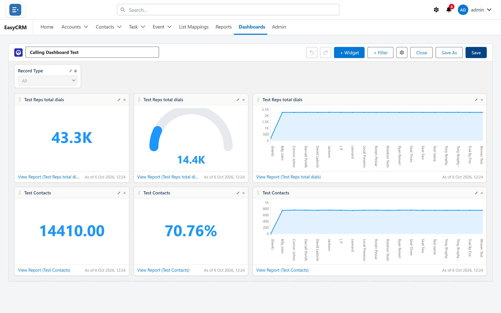
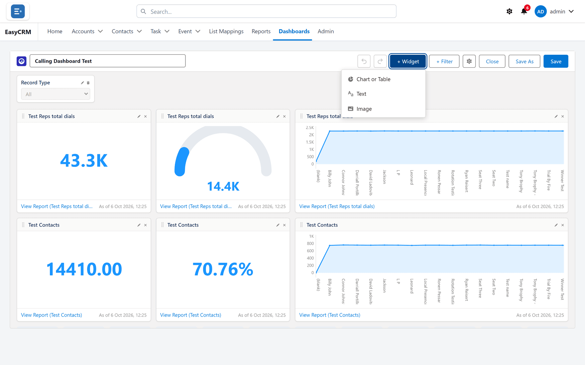
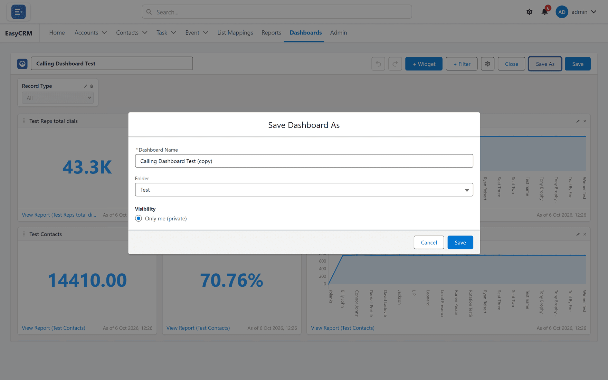

# The dashboard builder

**What it is.** The screen where you arrange a dashboard.

**What it does.** You add tiles, point each one at a report, and lay them out on a grid.

**Why it helps.** One screen answers the questions people ask every morning, instead of five
reports opened one at a time.

## Opening the builder

**Where:** **Dashboards** → a folder → the dashboard's name → **Edit**

For a new one: **Dashboards** → **New Dashboard**.

1. Click **Dashboards** in the top menu.
2. Click the folder, then the dashboard's **name**. It opens and the tiles load.
3. Click **Edit** at the top.

If **Edit** is missing you have read-only access. Use **Save As** to take your own copy.

## Adding a tile

**Where:** the dashboard builder → **+ Widget**

1. Click **+ Widget** at the top.
2. Choose the **report** the tile reads from.

   

3. Choose how it should look — see the table below.
4. Set the title and any units or decimal places.
5. Click **Save**.

**Every tile reads from a report.** If a number on a tile looks wrong, open its report — that
is where the figure comes from, and the tile is only drawing it.

## The kinds of tile

| Tile | Shows | Good for |
|---|---|---|
| **Metric** | One big number | A single figure people watch daily. |
| **Bar** / **Column** | Groups side by side | Comparing. |
| **Line** | A value over time | Trends. |
| **Pie** / **Donut** | Parts of a whole | A handful of categories. |
| **Gauge** | Progress to a target | Targets. |
| **Table** | Rows straight from the report | Detail people need to read. |

## Moving and resizing tiles

- **To move:** drag the tile.
- **To resize:** drag its corner.

Tiles snap to the grid. How fine that grid is comes from **Properties** — see
[Dashboard settings](./dashboard-properties.md).

## Changing or removing a tile

Use **Edit** or **Remove** on the tile itself.

Removing a tile does not touch its report. The report stays exactly where it was.

## Undo and redo

**Undo** and **Redo** at the top step through your changes. Nothing is saved until you click
**Save**, so you can rearrange freely.

## Saving

| Button | What it does |
|---|---|
| **Save** | Keeps your changes to this dashboard. |
| **Save As** | Makes a copy under a new name, leaving the original alone. |

**Save As** is the safe way to change somebody else's dashboard.
