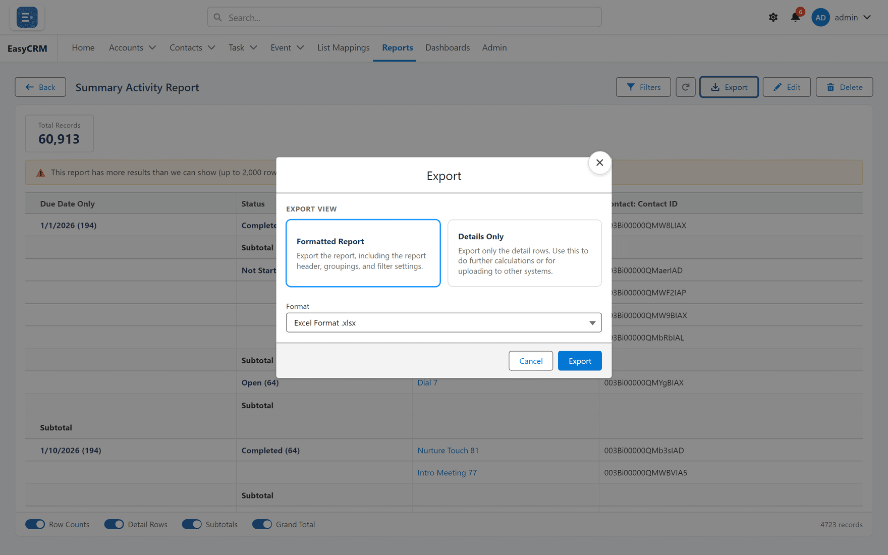

# Exporting a report

**What it is.** Downloading a report as a spreadsheet file.

**What it does.** It writes the report to a file you can open in Excel or Google Sheets.

**Why it helps.** For sending to somebody without a portal login, or for working on the
numbers somewhere else.

## Exporting

**Where:** **Reports** → a folder → the report's name → **Export**

1. Click **Reports** in the top menu.
2. Click the folder, then the report's **name**. It runs.
3. Click **Export** at the top.
4. Choose which kind of export you want.

   

5. Click **Export**.

The file downloads through your browser, like any other download.

## The two kinds

| Kind | What you get | Use it when |
|---|---|---|
| **Formatted Report** | What you see — groups, subtotals and headings kept. | It is the finished thing. |
| **Details Only** | Just rows and columns, no grouping. | It is a starting point for more work. |

**Details Only** is nearly always the right choice if the spreadsheet is going to be sorted,
filtered or pivoted. Group headings get in the way of all three.

## What gets exported

Whatever the report currently shows, including any filters you changed while reading it.

If you narrowed the report before exporting, the file is narrowed too. That is usually what
people want, but it surprises them if they have forgotten.

## A word about what leaves the portal

An exported file is an ordinary spreadsheet. Nothing in it is protected any more — no sharing
rules, no permissions. Anybody who gets the file sees everything in it.

Think about that before exporting anything with personal data, and prefer sharing the report
itself where you can — see [Sharing a report](./share-a-report.md).
