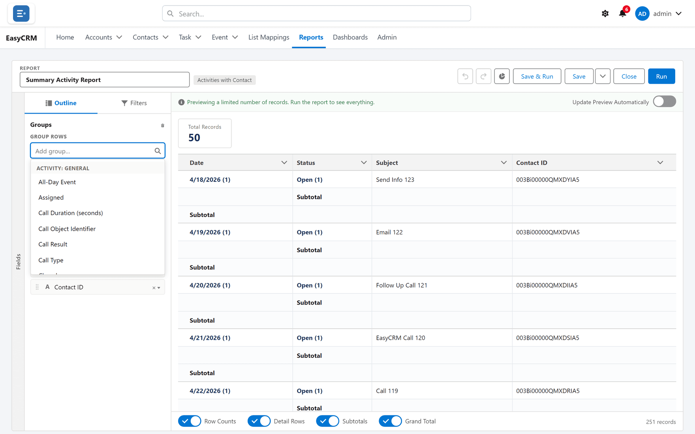
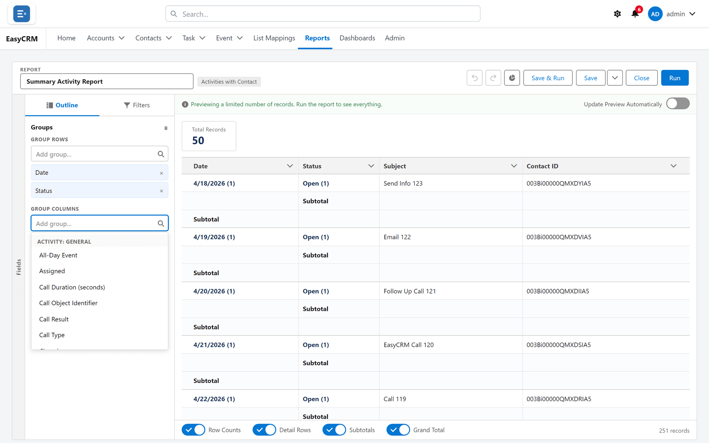

# Grouping and totals

**What grouping is.** Gathering rows that share a value, so they appear together under one
heading.

**What a total is.** Adding up a column, for each group and for the whole report.

**Why it helps.** This is the difference between a list and an answer. "How many per rep this
month" is a grouping, not a search.

## Grouping rows

**Where:** the builder → **Outline** → **Add group…** under **Group Rows**

1. Open the report in the builder — see [The report builder](./report-builder.md).
2. Click the **Outline** tab.
3. Find **Group Rows**, and click the **Add group…** box under it.
4. Pick the field to group by — Owner, for example.

   

The preview changes. Instead of a flat list you now get one block per value, each with its own
subtotal, and a grand total at the bottom.

**To group further**, add a second group. Each block is then broken down again inside itself.

**To remove a group**, click the small cross beside it, or use **Remove all groups**.

## Grouping across the top as well

**Where:** the builder → **Outline** → **Add group…** under **Group Columns**

This turns the report into a grid — a **matrix**.

1. In the **Outline** tab, find **Group Columns**.
2. Click the **Add group…** box under it.
3. Pick a field.

   

You now have groups down the left **and** across the top, with a figure in every cell. Owner
down the side and month across the top, for example.

Use a matrix when the question has two dimensions. Use a plain grouping when it has one.

## Totalling a column

**Where:** the builder → a column heading → **Column actions**

1. In the preview, find the number column you want to total.
2. Click **Column actions** on its heading.
3. Choose how to summarise it.

| Option | Gives you |
|---|---|
| **Sum** | Everything added together. |
| **Average** | The mean. |
| **Min** | The smallest value. |
| **Max** | The largest value. |

The total now appears on every group heading and at the bottom of the report.

You can pick more than one. Sum and Average together is common.

## The three shapes a report can have

| Shape | What it looks like | Use it when |
|---|---|---|
| **Tabular** | A plain list, no groups | You want the records themselves. |
| **Summary** | Grouped down the side, with subtotals | You want totals per group. |
| **Matrix** | A grid, grouped down **and** across | You are comparing two things at once. |

You do not choose the shape from a menu — it follows from what you group. No groups is
tabular, row groups is summary, row and column groups is matrix.

## A report must be grouped to have a chart

A chart draws groups. If **Chart properties** does nothing, add a row group first. See
[Charts on a report](./charts.md).
