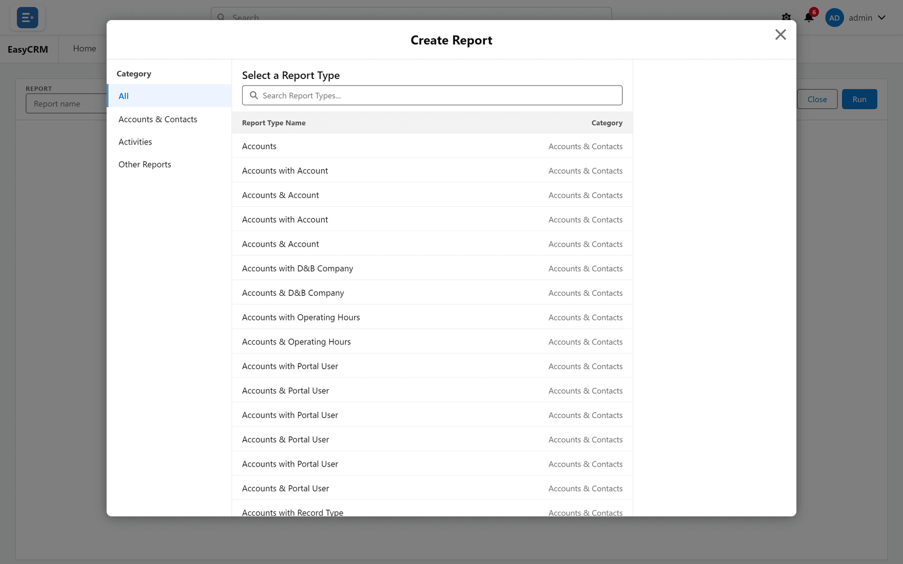
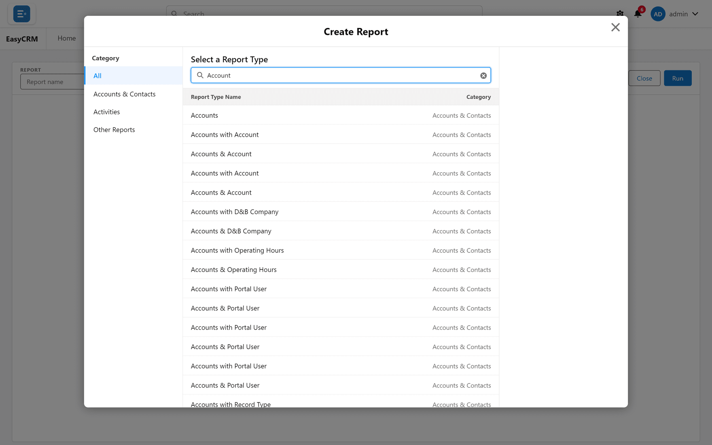

# Starting a new report

**What it is.** The first question a new report asks: what is this report about?

**What it does.** The **report type** decides which records the report can include and which
fields you can use.

**Why it matters.** The report type is fixed once the report exists. Choosing the wrong one
means starting again, so it is worth a moment's thought.

## Starting one

**Where:** **Reports** → **New Report**

1. Click **Reports** in the top menu.
2. Click **New Report** at the top right.
3. The report type chooser opens.

   

4. Type into **Search Report Types...** to narrow the list.

   

5. Click the type you want.
6. The builder opens, empty and ready.

See [The report builder](./report-builder.md) for what to do next.

## Choosing the right type

The type is named after the records it covers.

| Type | Gives you |
|---|---|
| **Accounts** | Accounts, and account fields only. |
| **Contacts** | Contacts, and contact fields only. |
| **Accounts with Contacts** | Both, one row per contact. |

If you need fields from two kinds of record in the same report, you must pick a type that
pairs them. You cannot add the second one later.

## "with" versus "with or without"

Some types come in two versions, and the difference matters.

| Type | What it includes |
|---|---|
| **Accounts with Contacts** | Only accounts that have at least one contact. |
| **Accounts with or without Contacts** | Every account, whether or not it has contacts. |

Pick **with or without** when you want to find the gaps — accounts nobody has a contact for,
for example. Pick **with** when a record is only interesting if it has the other thing.

Choosing **with** by accident is the usual reason a report shows fewer records than expected.

## Changing the type afterwards

Open the report in the builder and look for **Change Report Type**.

Changing it can drop columns and filters that the new type does not have, so the builder warns
you first.
