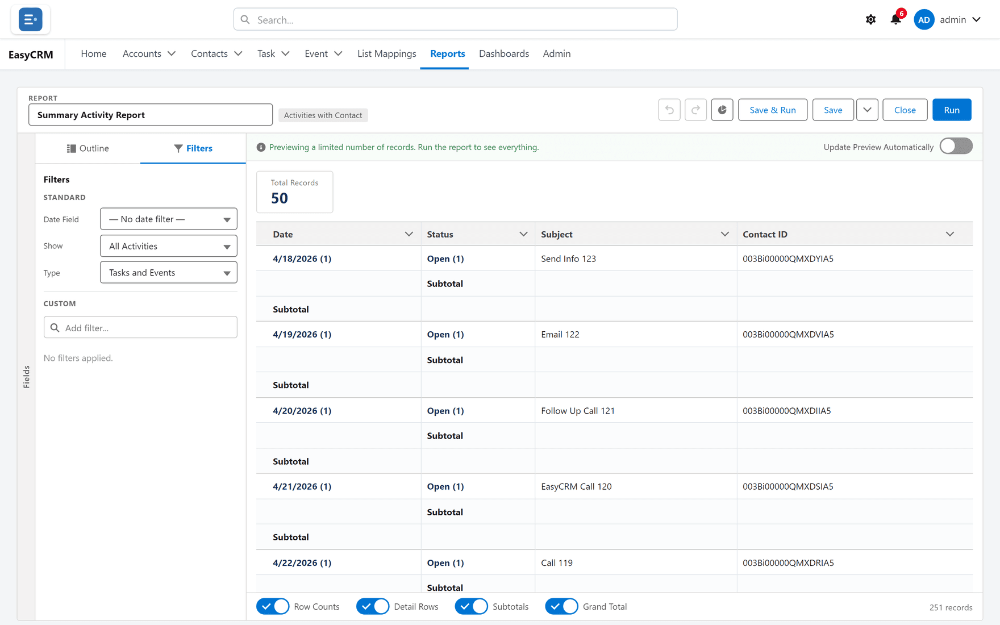

# Report filters

**What they are.** The rules that decide which records a report includes.

**What they do.** A filter keeps the rows you want and drops the rest, before any grouping or
totalling happens.

**Why it helps.** A report with no filters answers "everything". Most useful questions are
narrower: this quarter, this owner, this status.

## Adding a filter

**Where:** the builder → **Filters** → **Add Filter**

1. Open the report in the builder — see [The report builder](./report-builder.md).
2. Click the **Filters** tab at the top left.

   

3. Click **Add Filter**.
4. Choose three things:
   - **Field** — what to look at.
   - **Operator** — how to compare it: equals, contains, greater than, and so on.
   - **Value** — what to compare it to.
5. Click **Apply**.

The preview re-runs with fewer records.

By default a record must match **every** filter you add.

## Filter logic

Each filter has a number — 1, 2, 3 — in the order you added them.

1. In the **Filters** tab, click **Filter Logic**.
2. Type a rule using those numbers.

| Rule | Means |
|---|---|
| 1 AND 2 | Both must be true. This is the default. |
| 1 OR 2 | Either will do. |
| 1 AND (2 OR 3) | Filter 1, plus either 2 or 3. |
| 1 AND NOT 2 | Filter 1, but not filter 2. |

3. Click **Apply**.

Use **OR** when you want several alternatives — three different statuses, say. Use brackets
exactly as you would in arithmetic.

## Date filters

Most reports take a date range from a drop-down rather than two typed dates: this month, last
quarter, this year. Those move with time, so "last quarter" stays correct next month without
anybody editing the report.

Choose **Custom** when you need exact dates that should not move.

## Filtering a report while you read it

You do not have to open the builder to narrow a report you are looking at.

1. Open the report.
2. Click **Filters**.
3. Change a value.

This changes only your view, and only until you leave the page. The saved report is untouched.

## Locked filters

Some filters are set by whoever built the report and cannot be changed or removed by anybody
reading it. They are how a report meant for one company stays limited to that company.

If a filter will not change, it is locked. Ask whoever owns the report.
