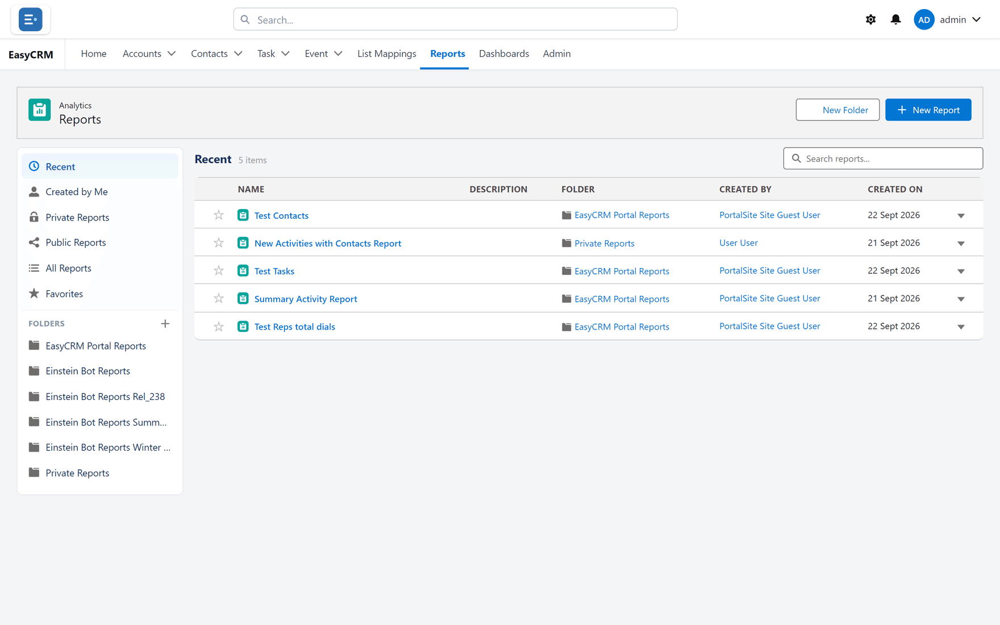

# Finding a report

Click **Reports**.

Reports are kept in folders. Click a folder on the left to see what is inside.

| Folder | What is in it |
|---|---|
| **Recent** | What you opened lately. |
| **Favorites** | Reports you starred. |
| **Private Reports** | Reports only you can see. |
| **Shared folders** | Reports your company shares. |

Click a report to run it.

## Starring a report

Click the star next to its name. It then appears under **Favorites**.

## Making a folder

1. Click **New Folder**.
2. Type a name.
3. Click **Save**.

