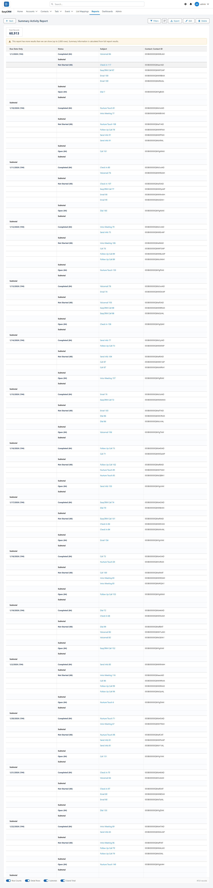

# Running a report

Click a report's name and it runs.

The number of records is shown at the top. Blue text is a link — click it to open that record.

## Changing what it shows, just for now

Click **Filters** to change the values a report uses. This does **not** change the saved
report, only what you are looking at right now.

Some filters are locked by whoever built the report. You cannot change those.

## Refreshing

Click **Refresh** to fetch the latest data.

## Exporting

Click **Export** to download the report as a spreadsheet.
