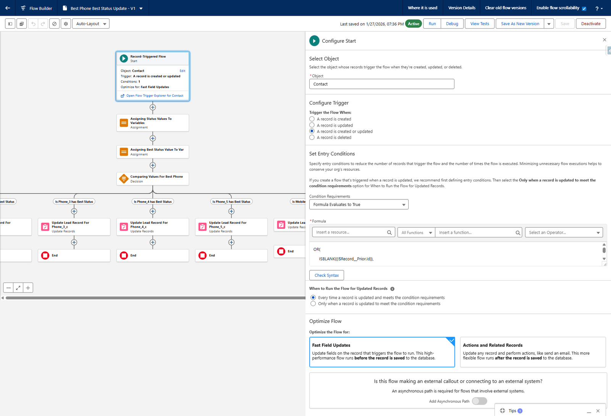

# Best Phone Best Status Update

## The problem it solves

A contact can hold seven phone numbers — Phone, Mobile and Phone 2 through 5 — each with its own
status scoring how good it is. A caller should not have to compare seven statuses before
dialling, and a report cannot filter on "whichever of these seven is best".

So one number is chosen and copied into **Best Phone**, with its status copied into
**Best Phone Status**. Everything downstream reads those two fields and nothing else.

## What it is

| | |
|---|---|
| **Flow label** | Best Phone Best Status Update |
| **API name** | `Best_Phone_Best_Status_Update` |
| **Type** | Record-Triggered Flow, **run before save** |
| **Object** | Contact |
| **Trigger** | A record is created **or** updated |
| **Optimised for** | Fast Field Updates |
| **Status** | Active |

**Where:** **Setup** → search **Flows** → **Best Phone Best Status Update**



## Why "before save" matters

A before-save flow changes the record **on its way into the database**, in the same transaction
that saved it. There is no second update, so:

- the field is correct the instant the record is saved, not a moment later
- it costs a fraction of what an after-save flow costs
- it cannot trigger itself, because no second save happens

The trade-off is that a before-save flow may only update **the record that triggered it**. That
is all this flow needs.

## The entry condition

**Condition Requirements:** Formula Evaluates to True

```
OR(
  ISBLANK({!$Record__Prior.Id}),
  …
)
```

`$Record__Prior.Id` is blank only on a **create**, so the first branch means "always run for a
new contact". The remaining branches cover the phone and status fields, so an update only
re-runs the flow when one of them actually changed.

**When to Run the Flow for Updated Records** is set to *Every time a record is updated and meets
the condition requirements*.

:::note
The original build document shows this formula truncated in a screenshot, so only the first
branch is legible there. Read the live flow before changing it.
:::

## What it does, in order

### 1. Assigning Status Values To Variables

An Assignment that copies the six statuses into variables:

| Variable | Set to |
|---|---|
| `Phone1_Status_Var` | Triggering Contact → Phone Status |
| `Phone2_Status_Var` | Triggering Contact → Phone 2 Status |
| `Phone3_Status_Var` | Triggering Contact → Phone 3 Status |
| `Phone4_Status_Var` | Triggering Contact → Phone 4 Status |
| `Phone5_Status_Var` | Triggering Contact → Phone 5 Status |
| `Mobile_Status_Var` | Triggering Contact → Mobile Status |

### 2. Assigning Best Status Value To Var

| Variable | Set to |
|---|---|
| `Best_Status_Var` | `Getting_Best_Status` |

`Getting_Best_Status` is a formula resource that works out which of the six statuses is the
best one. **Its definition is not in the original build document** — open the flow to read it.
It is the only piece of judgement in the whole flow; everything after it is mechanical.

### 3. Comparing Values For Best Phone

A Decision with seven outcomes, evaluated **in this order**:

| Order | Outcome | Condition |
|---|---|---|
| 1 | Is Phone_1 has Best Status | `Phone1_Status_Var` equals `Best_Status_Var` |
| 2 | Is Phone_2 has Best Status | `Phone2_Status_Var` equals `Best_Status_Var` |
| 3 | Is Phone_3 has Best Status | `Phone3_Status_Var` equals `Best_Status_Var` |
| 4 | Is Phone_4 has Best Status | `Phone4_Status_Var` equals `Best_Status_Var` |
| 5 | Is Phone_5 has Best Status | `Phone5_Status_Var` equals `Best_Status_Var` |
| 6 | Is Mobile has Best Status | `Mobile_Status_Var` equals `Best_Status_Var` |
| 7 | **Default Outcome** | No conditions |

**Order is the tie-break.** When two numbers share the best status, the first matching outcome
wins — so Phone beats Phone 2, which beats Mobile. If you want a different preference, reorder
the outcomes; there is nothing else deciding it.

### 4. One Update Records element per outcome

Each is an Update Records on **the contact record that triggered the flow**, with Condition
Requirements set to **None — Always Update Record**:

| Element | Best Phone Status | Best Phone |
|---|---|---|
| Update Lead Record For Phone_1_c | `Best_Status_Var` | Triggering Contact → Business Phone |
| Update Lead Record For Phone_2_c | `Best_Status_Var` | Triggering Contact → Phone 2 |
| Update Lead Record For Phone_3_c | `Best_Status_Var` | Triggering Contact → Phone 3 |
| Update Lead Record For Phone_4_c | `Best_Status_Var` | Triggering Contact → Phone 4 |
| Update Lead Record For Phone_5_c | `Best_Status_Var` | Triggering Contact → Phone 5 |
| Update Lead Record For Mobile | `Best_Status_Var` | Triggering Contact → Mobile Phone |
| **Default Update** | `Best_Status_Var` | **Blank Value (empty string)** |

Each path then ends.

## The default path is doing real work

When no status matches the best one, **Best Phone is cleared** — set to an empty string — while
Best Phone Status is still written.

That is deliberate, and it is what keeps the reports honest: a contact with no usable number
reports as having no best phone, rather than keeping a stale number from a previous run.

## Two naming quirks

**"Update Lead Record For …"** — these elements act on **Contact**, not Lead. The names are a
leftover. Do not read them as evidence that Leads are involved.

**"Phone_1_c"** — there is no `Phone_1__c` field. Outcome 1 is about the standard **Phone**
field, which the update element calls *Business Phone*. The numbering in the flow runs 1–5 while
the fields run Phone, Phone 2, Phone 3, Phone 4, Phone 5.

## What depends on this

| Depends on it | How |
|---|---|
| The Contact layout | Shows Best Phone and Best Phone Status at the top |
| Most P1 Tracker reports | Filter on **Best Phone Status contains P1** |
| The dialler | Calls the best number |

If Best Phone looks wrong across many contacts at once, check the flow is still **Active** before
looking anywhere else.

## What goes wrong

| Symptom | Cause |
|---|---|
| Best Phone empty on everybody | The flow is deactivated, or `Getting_Best_Status` returns nothing. |
| Best Phone stale after a number changed | The entry condition did not match. Check it covers that field. |
| The wrong number is chosen between two equals | Outcome order. Reorder the Decision. |
| Reports count fewer P1s than expected | Best Phone Status is the filter; check it is being written. |

## Where this fits

The fields are in [Custom fields](../fields/custom.md). The reports that read Best Phone Status
are in [the P1 Tracker reports](../reports/p1-tracker.md).
