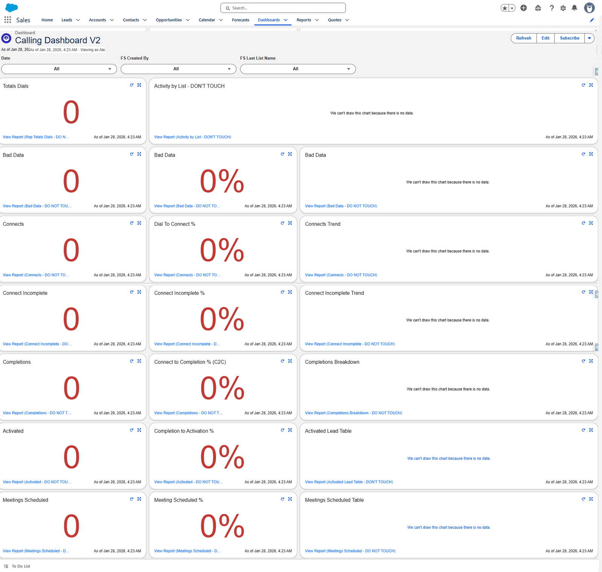

# Calling Dashboard V2

The same funnel, with three things the first one does not have: **data quality**, **which lists
are being worked**, and **a stage between connect and completion**.

## What changed from V1

| Added | Why |
|---|---|
| **Activity by List** | Which calling lists are actually getting called |
| **Bad Data** — three tiles | How much of the list is wrong |
| **Connect Incomplete** — three tiles | Reached somebody but did not finish: a stage V1 hid |
| **Completions Breakdown** | *Why* calls completed, not just how many |
| **Activated Lead Table** and **Meetings Scheduled Table** | The actual people, not just a count |

| Removed | Why |
|---|---|
| Dials by Rep | The filter does the same job |
| The Activated and Meetings trends | Crowded out |

## Filters

| Filter | From |
|---|---|
| **Date** | Activity |
| **FS Created By** | Activity |
| **FS Last List Name** | Activity |

**Campaign // List Name is gone**, replaced by **FS Last List Name**. The first is a Contact
field, the second is an Activity field — so V2 filters by *the list the call was made from*
rather than *the list the contact belongs to*.

That is a meaningful difference. A contact can sit on one list and be called from another; V2
tells you about the calling, V1 about the people.

## Tile by tile

| Tile | Report | Shown as | Measure | Ranges |
|---|---|---|---|---|
| Totals Dials | Rep Totals Dials | Metric | Sum of Rep Attempts | 33 / 67 |
| Activity by List | Activity by List | Horizontal bar — Campaign // List Name × Record Count | | — |
| Bad Data | Bad Data | Metric | Sum of Bad Data | 1 / 4 |
| Bad Data | Bad Data | Metric | Bad Data % | 5 / 10 |
| Bad Data | Bad Data | **Donut** — sliced by Call Result | Sum of Bad Data | — |
| Connects | Connects | Metric | Sum of Connects Counter | 10 / 40 |
| Dial To Connect % | Connects | Metric | D2C% | 15 / 20 |
| Connects Trend | Connects | Line — Date × Sum of Connects Counter | | — |
| Connect Incomplete | Connect Incomplete | Metric | Sum of Connect - Incomplete | 4 / 10 |
| Connect Incomplete % | Connect Incomplete | Metric | Connect - Incomplete % | 5 / 25 |
| Connect Incomplete Trend | Connect Incomplete | Line — Date × Sum of Connect - Incomplete | | — |
| Completions | Completions | Metric | Sum of Correct Completes | 10 / 35 |
| Connect to Completion % (C2C) | Completions | Metric | Correct Complete % | 50 / 60 |
| Completions Breakdown | Completions Breakdown | **Donut** — sliced by Call Result | Record Count | — |
| Activated | Activated | Metric | Sum of Activated Connects | 5 / 18 |
| Completion to Activation % | Activated | Metric | Activated Connects % | 15 / 20 |
| Activated Lead Table | Activated Lead Table | **Table** — Account Name, Title, Follow Up Date | | — |
| Meetings Scheduled | Meetings Scheduled | Metric | Sum of Meeting Scheduled Connects | 2 / 4 |
| Meeting Scheduled % | Meetings Scheduled | Metric | Meeting Scheduled Connect % | 5 / 10 |
| Meetings Scheduled Table | Meetings Scheduled | **Table** — Account Name, Title, Follow Up Date | | — |

:::note
The **Meetings Scheduled Table** tile reads the **Meetings Scheduled** report displayed as a
table — not the separate
[Meetings Scheduled Table report](../reports/calculation.md#meetings-scheduled-table), which
exists but is not what this tile points at. Worth knowing before you edit either.
:::

## The three Bad Data tiles

They are the same report three ways, and they answer three different questions:

| Tile | Answers |
|---|---|
| **Count** | How many bad records did we find? |
| **Percent** | How bad is the list? |
| **Donut** | What kind of bad — wrong person, or gone? |

The donut is set to **combine small groups into "Others"**, show a total, sort the legend, and
display at most **six** values. Past six, everything else collapses into one slice — so a long
tail of distinct problems reads as a single blob.

## Connect Incomplete is the useful addition

V1 goes straight from Connects to Completions, so a call where somebody answered but the
conversation did not finish just looks like a missing completion.

V2 counts them. A rising **Connect Incomplete %** against a steady connect rate means calls are
being reached and lost — which is a coaching problem, not a list problem.

## What goes wrong

| Symptom | Cause |
|---|---|
| Activity by List is empty | Its filter is **Subject starts with Call**. Activities logged with another subject do not appear. |
| The Bad Data donut shows one slice | Six-value cap. Raise **Max Values Displayed**. |
| A table tile is cut off | Table tiles do not scroll far. Open the report. |
| Filtering by list changes nothing | **FS Last List Name** is an Activity field. A tile on a Contact report will not respond. |

## Where this fits

The simpler version is [Calling Dashboard](./calling.md). The people-oriented one is
[P1 Tracker](./p1-tracker.md).
