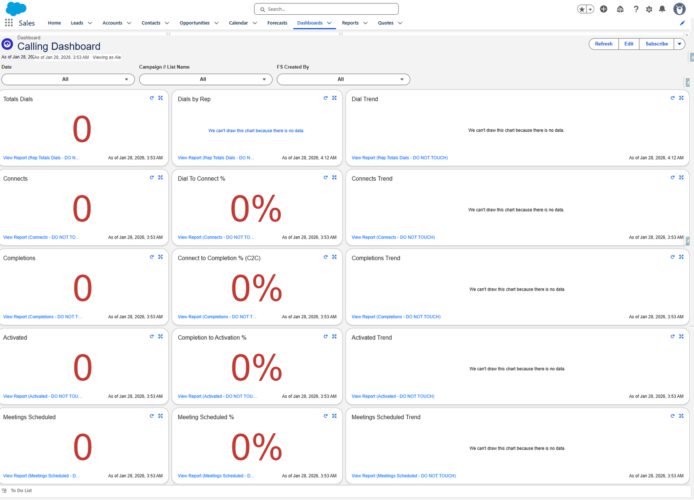

# Calling Dashboard

**The funnel, rep by rep.** Five stages, each shown three ways: a count, a conversion percentage,
and a trend.

## Filters

| Filter | From |
|---|---|
| **Date** | Activity |
| **Campaign // List Name** | Contact |
| **FS Created By** | Activity |

## The grid

Five rows, three columns. Reading across a row gives you the stage; reading down the first column
gives you the funnel.

| Stage | Count | Conversion | Trend |
|---|---|---|---|
| Dials | Totals Dials | Dials by Rep *(table)* | Dial Trend |
| Connects | Connects | Dial To Connect % | Connects Trend |
| Completions | Completions | Connect to Completion % (C2C) | Completions Trend |
| Activated | Activated | Completion to Activation % | Activated Trend |
| Meetings | Meetings Scheduled | Meeting Scheduled % | Meetings Scheduled Trend |

## Tile by tile

| Tile | Report | Shown as | Measure | Ranges |
|---|---|---|---|---|
| Totals Dials | Rep Totals Dials | Metric | Sum of Rep Attempts | 33 / 67 |
| Dials by Rep | Rep Totals Dials | Table, grouped by FS Created By | Record Count | — |
| Dial Trend | Rep Totals Dials | Line — Date × Sum of Rep Attempts | | — |
| Connects | Connects | Metric | Sum of Connects Counter | 10 / 40 |
| Dial To Connect % | Connects | Metric | D2C% | 15 / 20 |
| Connects Trend | Connects | Line — Date × Sum of Connects Counter | | — |
| Completions | Completions | Metric | Sum of Correct Completes | 10 / 35 |
| Connect to Completion % (C2C) | Completions | Metric | Correct Complete % | 50 / 60 |
| Completions Trend | Completions | Line — Date × Sum of Correct Completes | | — |
| Activated | Activated | Metric | Sum of Activated Connects | 5 / 18 |
| Completion to Activation % | Activated | Metric | Activated Connects % | 15 / 20 |
| Activated Trend | Activated | Line — Date × Sum of Activated Connects | | — |
| Meetings Scheduled | Meetings Scheduled | Metric | Sum of Meeting Scheduled Connects | 2 / 4 |
| Meeting Scheduled % | Meetings Scheduled | Metric | Meeting Scheduled Connect % | 5 / 10 |
| Meetings Scheduled Trend | Meetings Scheduled | Line — Date × Sum of Meeting Scheduled Connects | | — |

Every report above is in [the calculation reports](../reports/calculation.md); every measure is
in [Formula columns](../reports/formulas.md).

## Reading it

**Read down the first column, not across.** Dials → Connects → Completions → Activated →
Meetings is a funnel, and the interesting number is wherever it narrows most sharply.

**Each percentage is a conversion between two adjacent stages**, not a share of the total. Dial
to Connect % is connects ÷ dials; Connect to Completion % is completions ÷ connects.

**The trends share the same Date grouping**, so the five line charts can be compared directly.

## Four settings worth knowing

| Setting | Value | Why |
|---|---|---|
| Display Units | Full Number on metrics, Shortened Number on trends | A trend axis does not need every digit |
| Decimal Places | Automatic | |
| Max Groups Displayed | 100 | A trend or table silently stops at this many groups |
| Widget Theme | Light | |

## What goes wrong

| Symptom | Cause |
|---|---|
| Every tile reads zero | The date filter. These reports have no date of their own — the dashboard supplies it. |
| Dials far lower than expected | Check **Rep Totals Dials** for a stray filter — see [the warning](../reports/calculation.md#rep-totals-dials). |
| A percentage above 100% | The numerator and denominator are from different populations. Check the report's filter. |
| A tile stopped matching its report | Somebody edited a **DO NOT TOUCH** report. |

## Where this fits

The richer version is [Calling Dashboard V2](./calling-v2.md).
