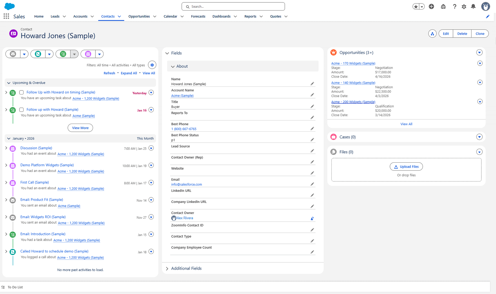
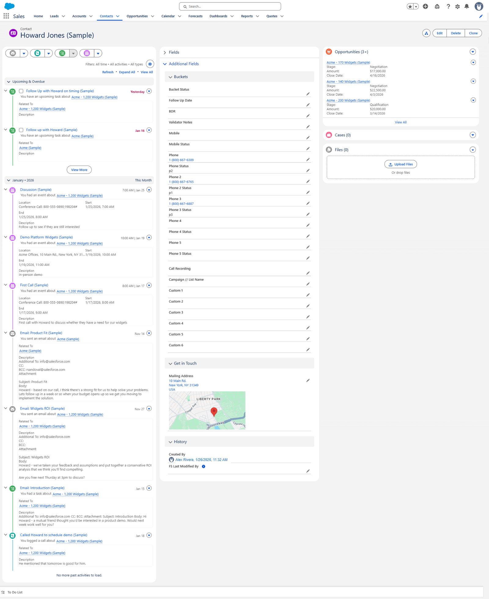
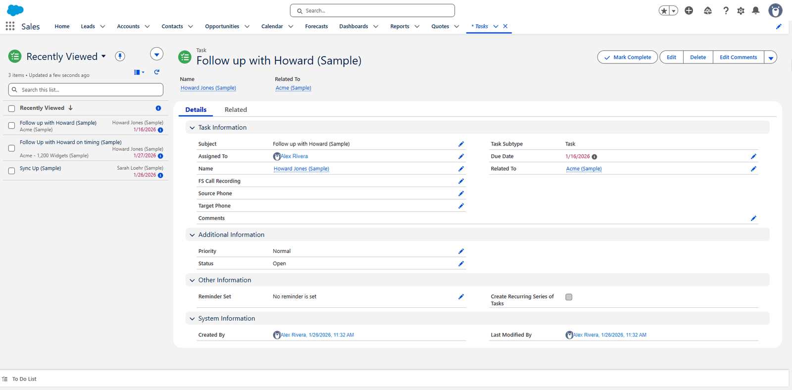

# Page layouts

Two layouts matter: what a caller sees on a **Contact**, and what they see on a **Task**.

## The Contact layout

**Where:** **Setup** → **Object Manager** → **Contact** → **Page Layouts**

It is arranged so the things a caller needs mid-call are at the top and the research sits below.

### About

| Field | Why it is this high |
|---|---|
| Name, Account Name, Title | Who am I speaking to, and where |
| Reports To | Who they answer to |
| **Best Phone** / **Best Phone Status** | The number to try, and how good it is |
| Lead Source, Contact Owner (Rep) | Where they came from, whose they are |
| Website, Email, LinkedIn URL, Company LinkedIn URL | Opening the research in one click |

**Best Phone and Best Phone Status sit directly under Title**, before anything else. That is the
whole point of the [flow](../automation/best-phone.md) — the caller should not have to compare
seven numbers.

### Additional Fields, and the Buckets section

Collapsed by default, holding everything that is not needed at the moment of dialling:

| Section | Holds |
|---|---|
| **Buckets** | Bucket Status, Follow Up Date, BDR, Validator Notes |
| | Mobile and Mobile Status |
| | Phone and Phone Status, Phone 2–5 and their statuses |
| | Call Recording, Campaign // List Name |
| | Custom 1–6 |
| **Get in Touch** | Mailing Address, with a map |
| **History** | Created By, FS Last Modified By |

All seven numbers and their statuses live here, not on the main panel, because the caller is
meant to read **Best Phone** instead.

### The left and right columns

| Column | Holds |
|---|---|
| Left | The activity timeline — every call, email, task and event, newest first |
| Right | Opportunities, Cases and Files |

The timeline on the left is what makes the record readable: it is the record of what has already
been tried.

## The Task layout

**Where:** **Setup** → **Object Manager** → **Task** → **Page Layouts**

| Section | Fields |
|---|---|
| **Task Information** | Subject, Assigned To, Name, Task Subtype, Due Date, Related To |
| | **FS Call Recording**, **Source Phone**, **Target Phone**, Comments |
| **Additional Information** | Priority, Status |
| **Other Information** | Reminder Set, Create Recurring Series of Tasks |
| **System Information** | Created By, Last Modified By |

**Source Phone** and **Target Phone** are the custom part: they record which number was dialled
*from* and *to*. Without them a call is just an activity; with them you can tell which of the
seven numbers actually worked.

**FS Call Recording** links to the recording in FrontSpin.

## What is deliberately not on these layouts

The enrichment-vendor fields — the various supplier phone numbers and their statuses — are not
shown. They feed the Best Phone calculation and are not something a caller should read directly.

## Where this fits

The fields themselves are in [Custom fields](../fields/custom.md). What fills **Best Phone** is
[the flow](../automation/best-phone.md).
