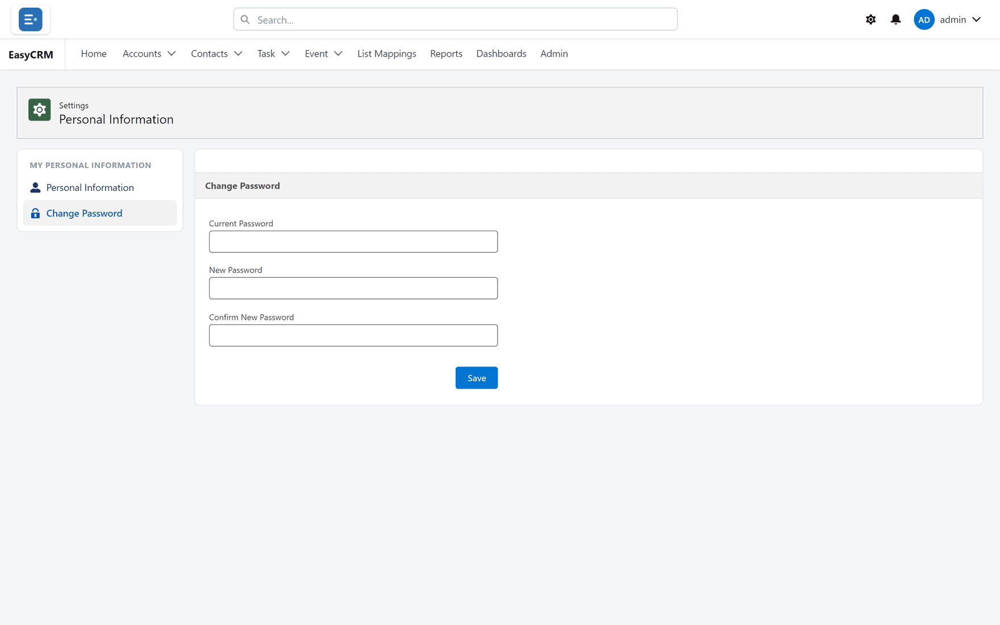

# Changing your password

**What it is.** Setting a new password for yourself.

**Why it matters.** The password your administrator sent arrived by email, which means it has
been sitting in an inbox. Changing it to something only you know is worth doing on your first
day.

## Changing it

**Where:** your name (top right) → **Settings** → **Change Password**

1. Click your name in the top right corner.
2. Click **Settings**.
3. Click **Change Password**.

   

4. Type your **current** password.
5. Type your **new** password.
6. Type the new password again to confirm it.
7. Click **Save**.

You stay signed in. Use the new password next time.

## If it will not save

| Message | What to do |
|---|---|
| The current password is wrong | Check for typing mistakes and Caps Lock. |
| The two new passwords do not match | Retype both. |
| The new password is not acceptable | Make it longer, and mix letters and numbers. |

## If you cannot remember the current one

You cannot change it from here — you need the old one.

Sign out and use **Forgot password?** on the sign-in page instead. See
[Signing in](../start/sign-in.md).

Your administrator can also set a new one for you.

## Choosing a password

Length matters more than symbols. Three or four unrelated words are both easier to remember
and harder to guess than one short word with a number stuck on the end.

Do not reuse a password from somewhere else.
