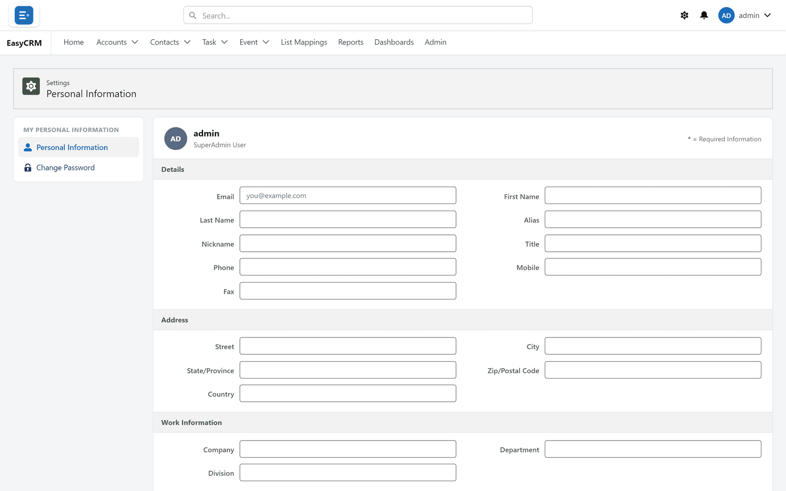

# Your profile

**What it is.** Your own details, and the settings that affect only you.

**Why it matters.** Nothing you change here affects anybody else.

## Opening it

**Where:** your name (top right) → **Settings**

1. Click your name in the top right corner of the screen.
2. Click **Settings**.

## What you can see

| Detail | Can you change it? |
|---|---|
| Your name | Usually yes. |
| Your username | No — your administrator sets it. |
| Your email address | Usually yes. Password resets go here, so keep it current. |
| Your role | No. See [What you can see](../start/what-you-can-see.md). |
| Your company | No. |

## Changing a detail

1. Click into the field.
2. Change it.
3. Click **Save**.

## Your password

See [Changing your password](./password.md).

## How the portal looks to you

That is not here — it is the **gear** in the top bar. See
[Getting around](../start/the-screen.md).

The whole page looks like this:

