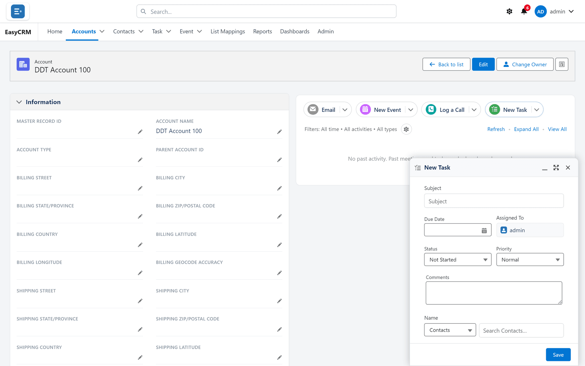
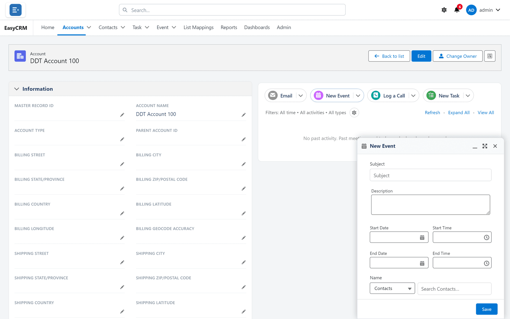
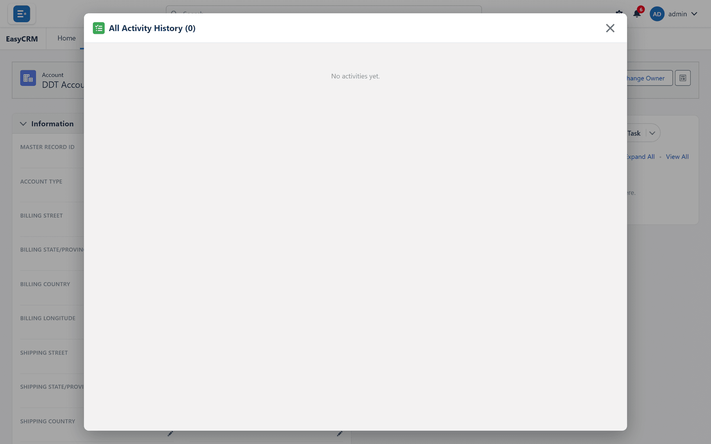

# Calls, tasks and meetings

**What it is.** The panel on the right-hand side of every record, showing everything that has
happened with it.

**What it does.** It keeps calls, tasks, meetings and emails attached to the record they
concern, in date order.

**Why it helps.** Anybody who opens the record can see the history straight away.

## Finding the panel

**Where:** **Accounts** → the record's name → the panel on the right

1. Click **Accounts** (or any tab) in the top menu.
2. Click the record's **name** to open it.
3. Look at the right-hand side of the page. The four coloured buttons at the top of that
   panel are how you add something.

## The four buttons

| Button | Use it for |
|---|---|
| **Email** | A message about this record. |
| **New Event** | A meeting, with a start and end time. |
| **Log a Call** | A call that has **already happened**. |
| **New Task** | Something still **to do**. |

The difference between **Log a Call** and **New Task** is time: one is a record of the past,
the other a reminder for the future.

## Logging a call

**Where:** a record → **Log a Call**

1. Open the record.
2. Click **Log a Call** in the right-hand panel.
3. A small form opens.

   

4. Type what the call was about in **Subject**.
5. Add any detail in the comments box.
6. Click **Save**.

The call appears in the timeline below, dated today.

## Setting a task

**Where:** a record → **New Task**

1. Open the record.
2. Click **New Task**.

   

3. Type a **Subject** — what needs doing.
4. Set a **Due Date**.
5. Choose who it is **Assigned To**. It defaults to you.
6. Click **Save**.

The task now appears under **My Tasks** on that person's home page.

## Scheduling a meeting

**Where:** a record → **New Event**

1. Open the record.
2. Click **New Event**.

   

3. Type a **Subject**.
4. Set the **Start** and **End** times.
5. Click **Save**.

It appears under **Upcoming Events** on the home page of everybody it concerns.

## Narrowing what the timeline shows

Under the four buttons is a line reading something like
**Filters: All time • All activities • All types**.

1. Click the small gear beside it.
2. Choose a date range, whether to show done or outstanding items, and which types.
3. The timeline redraws.

## Seeing the whole history

1. Click **View All** on the right of the activity panel.
2. The full history opens on its own page.

**Expand All** opens every entry so you can read the detail without clicking each one.

## Changing or deleting an entry

1. Find the entry in the timeline.
2. Use **Edit** or **Delete** beside it.

You can only change entries you are allowed to change. If the buttons are missing, ask your
administrator.
