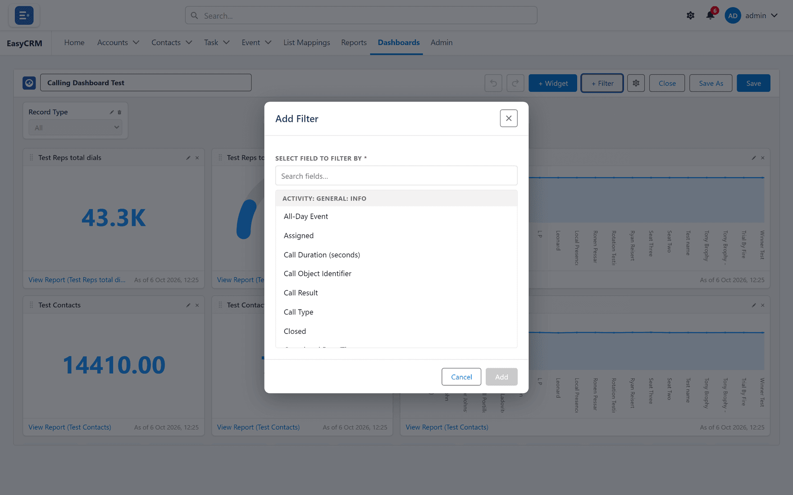
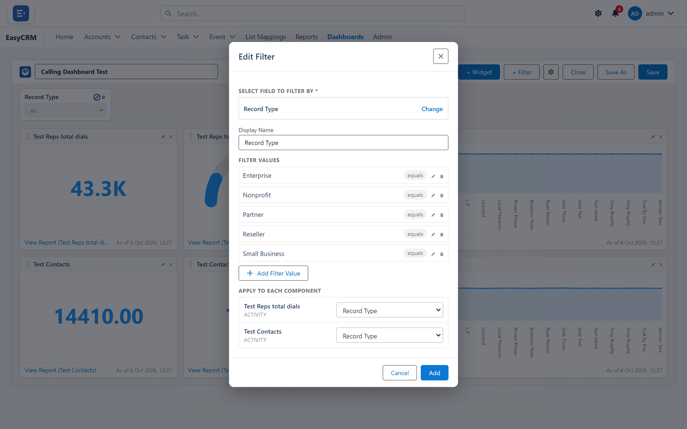

# Dashboard filters

**What it is.** A control at the top of a dashboard that changes every tile at once.

**What it does.** You pick one value — an owner, a region, a month — and all the tiles narrow
to it together.

**Why it helps.** One dashboard serves everybody. Without filters you would need a separate
copy per team.

## Adding a filter

**Where:** **Dashboards** → the dashboard's name → **Edit** → **+ Filter**

1. Click **Dashboards** in the top menu.
2. Open the dashboard, then click **Edit**.
3. Click **+ Filter** at the top.

   

4. Choose the field to filter by.
5. Add the values people will be able to choose from.
6. Set up **Apply to Each Component** — see below.
7. Click **Save**.

## Apply to Each Component

This is the part that is easy to miss, and the reason a filter sometimes seems not to work.

Each tile reads from a **different report**, and those reports do not always name the same
thing the same way. One might call it **Owner**, another **Assigned To**.

**Apply to Each Component** is where you tell the dashboard which field on each report the
filter matches.

- Fields with the same name are matched for you.
- You only have to set the ones that differ.
- **A tile you leave unmapped ignores the filter** and keeps showing everything.

That last point is what makes a dashboard look broken: nine tiles narrow and one does not.
If that happens, this is where to look.

## Editing a filter

1. Open the dashboard in the builder.
2. Click **Edit filter** on the filter you want to change.

   

3. Change it and click **Save**.

**Remove filter** deletes it. The tiles go back to showing everything.

## Using one

On the dashboard itself, choose a value from the filter bar at the top. Every mapped tile
updates together.

Click **Clear all** to return to the full picture.

Choosing a filter value changes only your own view, and only while you are on the page.
Nobody else is affected.
