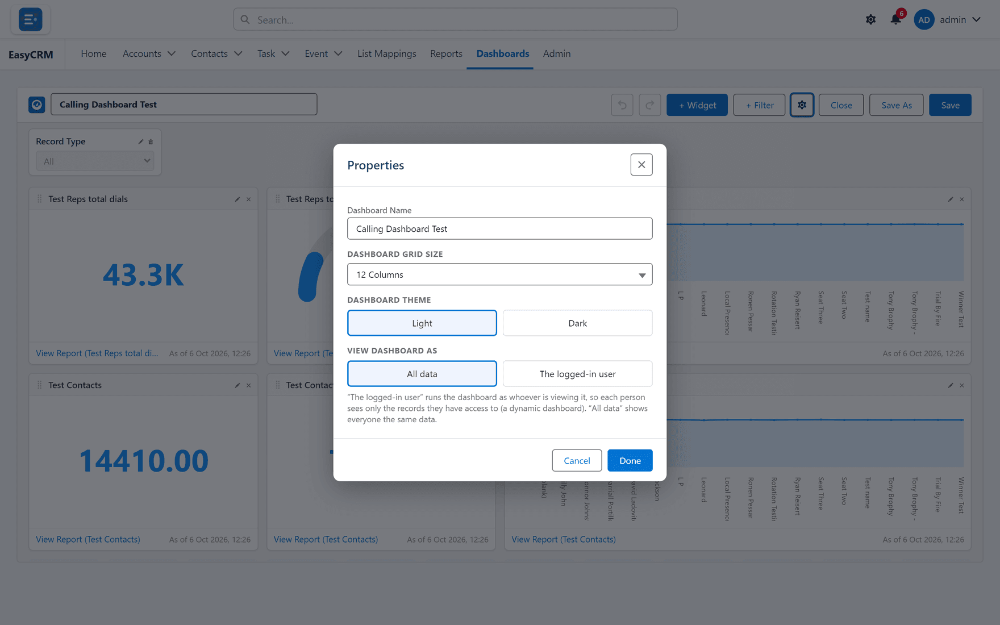

# Dashboard settings

**What it is.** The settings that apply to the whole dashboard rather than to one tile.

**What it does.** Name, layout, colours, and — most importantly — whose data the dashboard
counts.

**Why it matters.** That last one is the setting people most often get wrong, and it is not
obvious from looking at the dashboard that anything is amiss.

## Opening the settings

**Where:** **Dashboards** → the dashboard's name → **Edit** → **Properties**

1. Click **Dashboards** in the top menu.
2. Open the dashboard, then click **Edit**.
3. Click **Properties** at the top.

## View Dashboard As

This decides **whose records** the dashboard counts.

| Setting | What people see |
|---|---|
| **The logged-in user** | Each person sees their own numbers. |
| **All data** | Everybody sees the same totals, across every record. |

Use **the logged-in user** for a dashboard each person uses for their own work — "my pipeline",
"my tasks".

Use **all data** for a company-wide view that should look the same to everybody.

**Getting this wrong is quiet.** A rep set to "all data" sees the whole company's figures and
has no reason to doubt them. A manager set to "the logged-in user" sees only their own and
assumes the team is idle. Neither shows an error.

## Grid size

How many columns the dashboard is divided into.

More columns means finer control over tile sizes, but also more fiddling. Start with the
default and increase it only if tiles will not sit where you want.

## Themes

| Setting | Changes |
|---|---|
| **Dashboard Theme** | The page — **Light** or **Dark**. |
| **Widget Theme** | The tiles. |

They are separate so you can put light tiles on a dark page, which is a common look for a
dashboard shown on a wall screen.

## Name and description

The name is what people see in the dashboards list. A short description helps whoever finds it
in six months work out whether it is the one they want.
