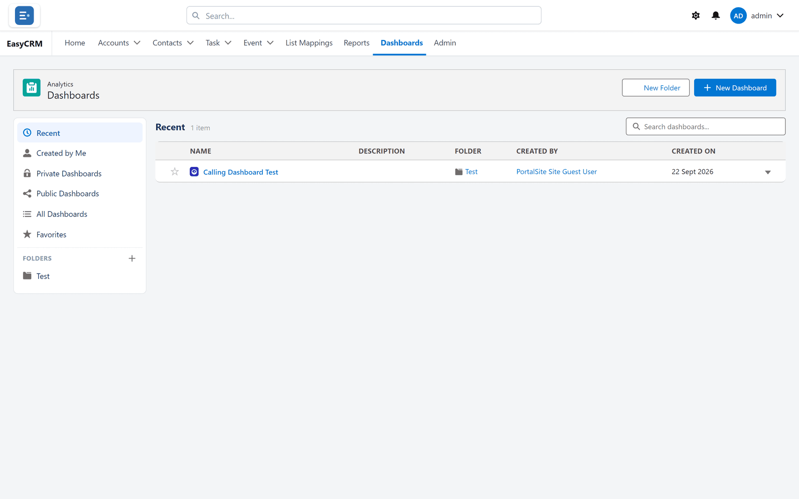
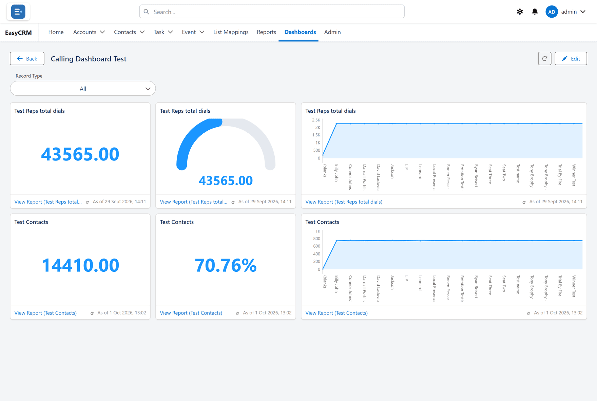

# Dashboards

**What a dashboard is.** One screen holding several charts and numbers.

**What it does.** Each tile reads from a report and draws its result.

**Why it helps.** The questions people ask every morning get answered at a glance, instead of
five reports opened one after another.

## Opening a dashboard

**Where:** **Dashboards** in the top menu → a folder → the dashboard's name

1. Click **Dashboards** in the row of tabs across the top.
2. The list opens, laid out the same way as Reports — folders on the left, dashboards on the
   right.

   

3. Click a folder, then the dashboard's **name**.
4. It opens and the tiles load.

## What you are looking at

Each tile is one chart or number, and each reads from one report.

If a figure looks wrong, open the report behind the tile — that is where the number comes
from, and the dashboard is only drawing it.

## Narrowing the whole dashboard at once

If the dashboard has filters, they sit in a bar across the top.

1. Choose a value from a filter.
2. **Every tile** updates together.
3. Click **Clear all** to go back to the full picture.

See [Dashboard filters](./filters.md).

## Getting the latest numbers

Click **Refresh** at the top.

Dashboards remember their last result so they open quickly, which matters when a dashboard has
twenty tiles. **Refresh** forces every tile to fetch fresh data.

## Changing a dashboard

Click **Edit** at the top to open the builder — see
[The dashboard builder](./builder.md).

If **Edit** is missing, you have read-only access. Use **Save As** in the builder, or ask the
owner.
