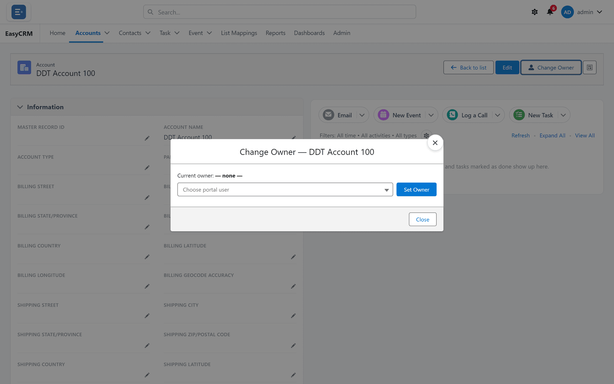

# Changing who owns a record

**What it is.** Moving a record from one person to another.

**What it does.** It changes who the record belongs to.

**Why it matters.** The owner usually decides who can see the record. Changing the owner can
change who has access, so this is not just a label.

## Changing the owner

**Where:** **Accounts** → the record's name → **Change Owner**

1. Click **Accounts** (or any tab) in the top menu.
2. Click the record's **name** to open it.
3. Click **Change Owner** at the top right of the record.
4. A window opens.

   

5. Start typing the new owner's name and pick them from the list.
6. Click **Save**.

The record now shows the new owner.

## When you would do this

- Somebody leaves and their accounts need a new home.
- A deal moves to a different rep.
- A record was created by the wrong person.

## What else changes

This is the part people miss.

Under **Private** sharing, the new owner can now see the record — and the previous owner may
no longer be able to. If access came from a sharing rule or from a manager relationship, that
follows the new owner too.

So if a colleague says a record has "disappeared", a change of owner is the first thing to
check. An administrator can see exactly who has access and why, under
[Checking who can see a record](../../admin/sharing/record-access.md).

## If the button is missing

You do not have permission to change the owner of that record. Ask your administrator.
