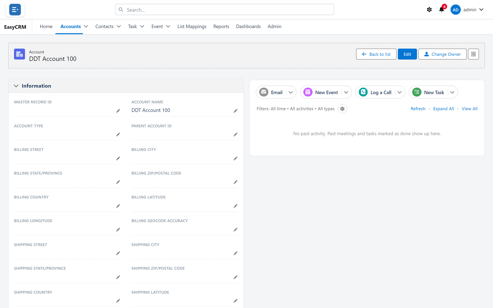

# Opening a record

**What it is.** The page for one single record, with everything known about it.

**What it does.** It shows the record's fields, plus the calls, tasks, files and linked
records that belong to it.

**Why it helps.** Everything about one customer sits in one place, so you are not piecing it
together from email and memory.

## Getting to a record

**Where:** **Accounts** (or any tab) → click the record's **name**

1. Click the tab for the kind of record you want — **Accounts**, for example.
2. The list opens. If it is empty, switch to the **All ...** list — see
   [Looking at a list](./lists.md).
3. Find the record you want. Use **Search this list...** if there are many.
4. Click the record's **name** in the first column. It is blue, which means it is a link.

The record opens.

**A faster way:** if you know the name, type it into **Search...** in the top bar and click the
result. That skips the list entirely.

## What you are looking at

Across the top of the record:

| What you see | What it does |
|---|---|
| The kind of record, and its name | Tells you where you are. |
| **Back to list** | Returns to the list you came from. |
| **Edit** | Lets you change the fields — see [Changing a record](./editing.md). |
| **Change Owner** | Moves the record to somebody else. |

Below that the page is in two halves.

**On the left: Information.** All the fields on this record, in sections. Each section has a
small arrow by its heading — click it to fold the section away.

**On the right: the activity panel.** Calls, tasks, meetings and emails attached to this
record. See [Calls, tasks and meetings](../activities/index.md).

**At the bottom: related records.** Other records linked to this one — the contacts at this
account, for example. See [Related records](./related-records.md).

## Blue text is clickable

Anywhere on the record, blue text does something:

| Blue text | What clicking it does |
|---|---|
| Another record's name | Opens that record. |
| An email address | Starts an email to it. |
| A phone number | Starts a call, on a device that can make them. |
| A web address | Opens it in a new tab. |

## Going back

Click **Back to list** at the top right, or your browser's back button. Both work.

## Scrolling through everything

A record can be long. Here is a whole one:

If a field you expect is missing, it is either empty, or your administrator has left it off
this layout. See [Page layouts](../../admin/layouts/index.md).
