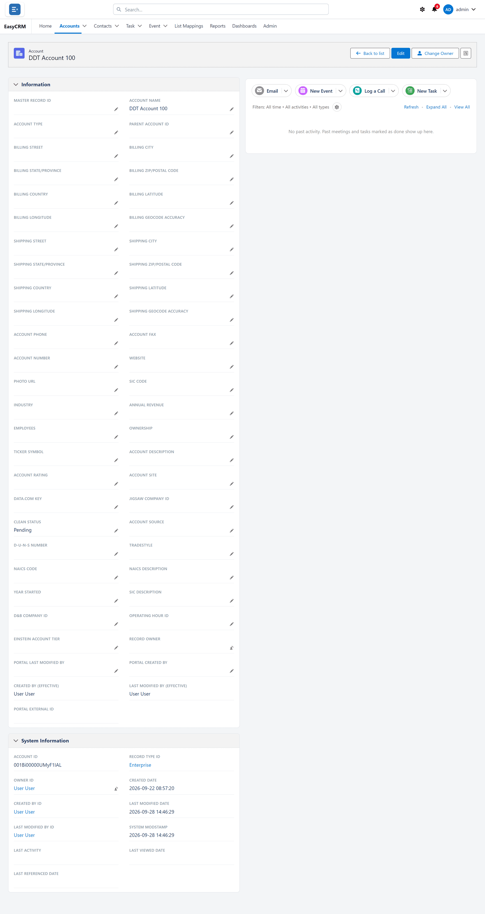

# Related records

**What it is.** The sections at the bottom of a record, showing other records linked to it.

**What it does.** An account shows its contacts. A contact shows its tasks. You move between
connected records without searching for them.

**Why it helps.** It answers "who else works at this company?" without you going to
**Contacts** and filtering.

## Finding them

**Where:** **Accounts** → the record's name → scroll to the bottom

1. Click **Accounts** (or any tab) in the top menu.
2. Click the record's **name** to open it.
3. Scroll to the bottom of the page.

Each related list is a small table with its own heading.

## Using them

- Click any **name** in a related list to open that record.
- If a list is long, it shows the first few with a link to see the rest.
- An empty list says so. That means nothing is linked yet — not that something is broken.

## If a related list is missing

Two possible reasons:

| Reason | Who fixes it |
|---|---|
| It is not on the page layout. | An administrator, under [Page layouts](../../admin/layouts/index.md). |
| You have no permission for that kind of record. | An administrator, under [Permissions](../../admin/access/permissions.md). |

An administrator chooses which related lists appear and which columns each shows.
