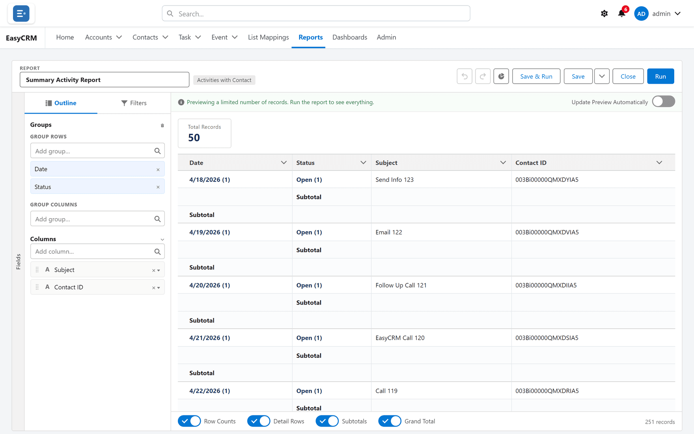
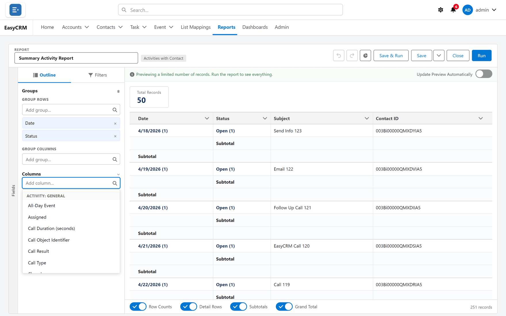
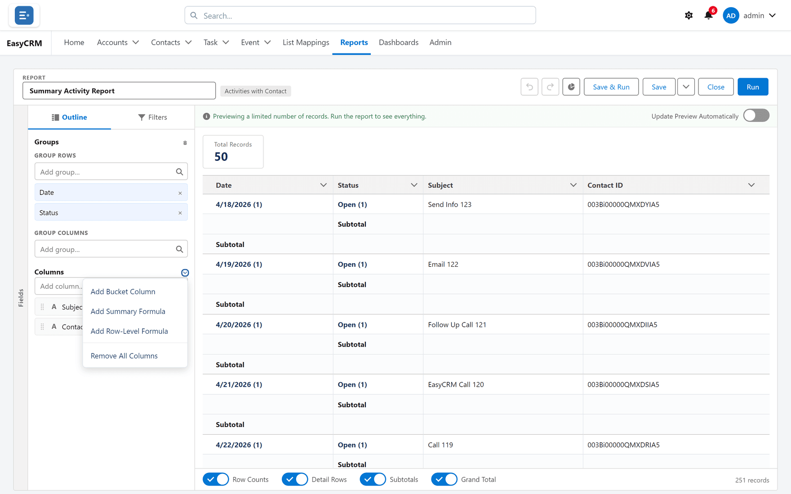
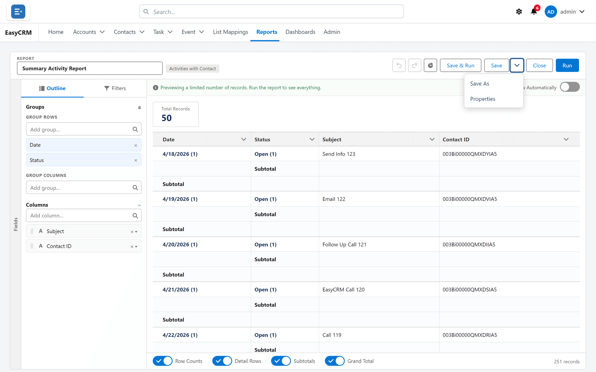

# The report builder

**What it is.** The screen where you decide what a report shows.

**What it does.** You choose which records to include, which columns to show, how to group
them and what to total. A preview updates as you go, so you see the answer before you save.

**Why it helps.** Nobody has to export to a spreadsheet and rebuild the same summary every
week.

## Opening the builder

There are two ways in.

**For a new report** — **Reports** → **New Report** → pick a type. See
[Starting a new report](./report-types.md).

**For an existing report** — **Reports** → a folder → the report's name → **Edit**.

1. Click **Reports** in the top menu.
2. Click the folder, then the report's **name**. It runs.
3. Click **Edit** at the top.

The builder opens.

## What you are looking at

| Part | Where | What it is for |
|---|---|---|
| **Outline** | Tab, top left | Your columns and groups. This is where you shape the report. |
| **Filters** | Tab, top left | Which records are included. |
| The preview | The large area on the right | What the report will look like. |
| **Report name** | Top | What it will be called. |
| **Undo** / **Redo** | Top | Step back or forward. |
| **Run** | Top right | See the full result rather than a preview. |
| **Save** | Top right | Keep it. |
| **Close** | Top right | Leave. You are warned if you have unsaved changes. |

Nothing is saved until you click **Save**, so you can experiment freely.

## Adding a column

**Where:** the builder → **Outline** → **Add column…**

1. Click the **Outline** tab if you are not already on it.

   

2. Click the **Add column…** box.
3. A list of available fields appears. Type to narrow it.

   

4. Click the field you want.

It appears in the preview straight away.

## Reordering and removing columns

- **To reorder:** drag a column in the Outline list into a new position.
- **To remove one:** click **Column actions** on its heading, then **Remove column**.

**Column actions** is also where you total a column — see
[Grouping and totals](./grouping.md).

## Saving your work

| Button | What it does |
|---|---|
| **Save** | Keeps your changes to this report. |
| **Save & Run** | Saves, then shows the full result. |
| **Save options → Save As** | Makes a copy under a new name and leaves the original alone. |

The first time you save, you are asked for a name and a folder.

**Save As** is the safe way to experiment with somebody else's report: take a copy, change the
copy, leave theirs alone.

## Leaving without saving

Click **Close**. If you have unsaved changes you are warned first, so you cannot lose work by
accident.
