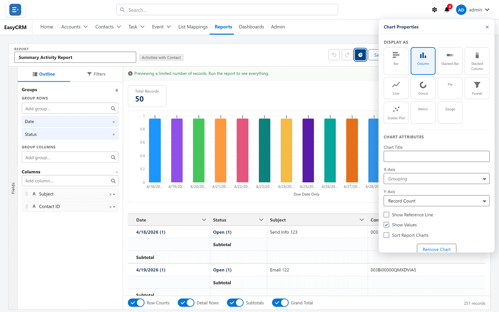

# Charts on a report

**What it is.** A picture of the report, shown above the table.

**What it does.** It draws whatever the report has grouped, measured by whatever the report
totals.

**Why it helps.** A trend or an outlier is obvious in a chart and invisible in four hundred
rows.

## A report must be grouped first

A chart plots **groups**. If the report has none, there is nothing to draw and the chart
options do nothing.

Add a row group first — see [Grouping and totals](./grouping.md).

## Adding a chart

**Where:** **Reports** → a folder → the report's name → **Edit** → **Chart properties**

1. Click **Reports** in the top menu.
2. Click the folder, then the report's **name**, then **Edit**.
3. Click **Chart properties** at the top.

   

4. Choose the **chart type**.
5. Choose what it **measures** — which total to plot.
6. Click **Apply**.
7. Click **Save**.

## Choosing a type

| Type | Best for | Avoid when |
|---|---|---|
| **Bar** / **Column** | Comparing groups | — |
| **Line** | A value changing over time | The groups are not in time order |
| **Pie** / **Donut** | Parts of one whole | There are more than about six slices |
| **Gauge** | Progress towards a target | There is no target |

A pie chart with twenty slices tells nobody anything. Use a bar chart.

## Sliced by

If a report has more than one grouping, you can choose which one the chart draws.

That means the same report answers two questions: by owner, or by month, without being
rebuilt.

## Charts on dashboards

A dashboard tile draws its own chart from the report's data, and does not have to match the
chart on the report. See [The dashboard builder](../dashboards/builder.md).
