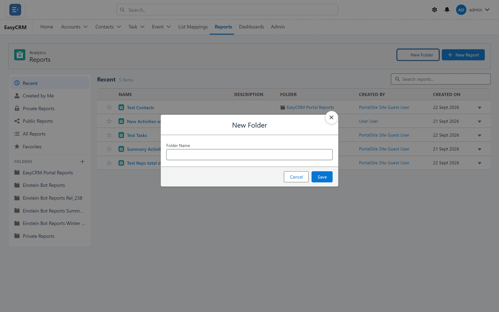
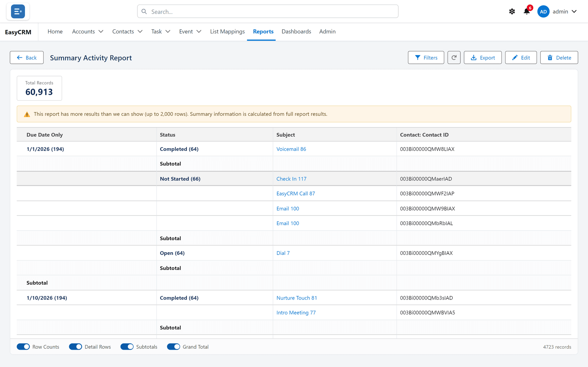

# Folders

**What it is.** Folders hold reports and dashboards, and decide who can see them.

**What it does.** A report lives in exactly one folder. Who can open the folder decides who
can open the report.

**Why it helps.** It is how one company's reports stay out of another's sight, without anybody
setting access report by report.

## The folders you always have

**Where:** **Reports** → the folder list on the left

| Folder | Who sees what is in it |
|---|---|
| **Recent** | Not a real folder — just what you opened lately. |
| **Favorites** | Reports you starred. |
| **Private Reports** | Only you. |
| Any folder you create | Whoever it is shared with. |

## Making a folder

**Where:** **Reports** → **New Folder**

1. Click **Reports** in the top menu.
2. Click **New Folder**.
3. Type a name.

   

4. Click **Save**.

A new folder starts out visible only to you.

## Letting other people see it

A Super Admin shares folders with companies, under
[Reports and Dashboards](../../admin/data/report-folders.md) in the Admin Console.

A folder shared with nobody is visible only to Super Admins — which is why a brand-new folder
looks empty to everybody else.

## Moving a report into a folder

**Where:** **Reports** → the report's name → **Edit Properties**

1. Click **Reports**, then open the report.
2. Click **Edit Properties**.

   

3. Change the **Folder**.
4. Click **Save**.

Moving a report changes who can see it, because access follows the folder. Moving something
into **Private Reports** hides it from everybody else immediately.

## Naming folders

Name them for the audience or the subject — "Sales — Monthly", "Support". Avoid names like
"New folder 2", which tell nobody anything when there are twenty of them.
