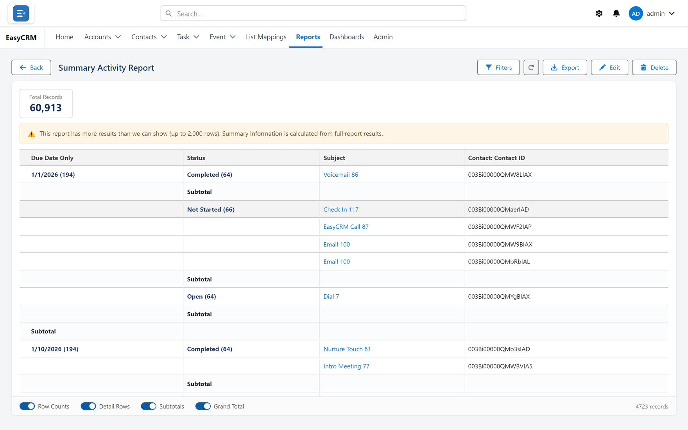
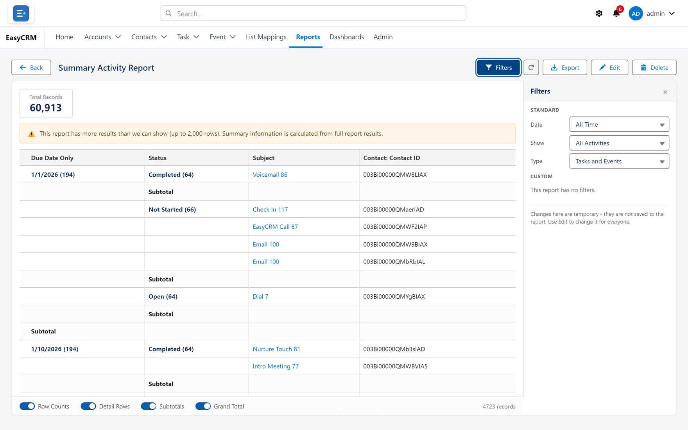

# Running a report

**What it is.** Opening a saved report to see today's answer.

**Why it helps.** A report is never out of date. It reads the data at the moment you open it,
so there is no old copy to worry about.

## Running one

**Where:** **Reports** → a folder → the report's name

1. Click **Reports** in the top menu.
2. Click the folder the report is in, on the left.
3. Click the report's **name**.
4. It runs. Large reports take a few seconds.

## What you are looking at

- **Total Records** at the top — how many rows the report found.
- The table itself. If the report is grouped, each group has a heading and a subtotal.
- A chart above the table, if the report has one.
- Blue text is clickable. Click a record's name to open it.

## Changing what it shows, just for now

**Where:** an open report → **Filters**

1. With the report open, click **Filters**.
2. The panel opens showing the report's filters.

   

3. Change a value.
4. The report re-runs with your change.

**This does not change the saved report.** It only changes what you are looking at, and only
until you leave the page. Everybody else still sees the report as it was saved.

Some filters are **locked** by whoever built the report, and you cannot change or remove
those. That is how a report meant for one company stays limited to it.

To change the report permanently, click **Edit** — see
[The report builder](./builder-tour.md).

## Getting the very latest numbers

Click **Refresh**. Reports remember their last result briefly so they open quickly, so use
**Refresh** when something has just changed and you need to see it.

## Taking it away with you

Click **Export** to download it as a spreadsheet — see [Exporting a report](./exporting.md).
