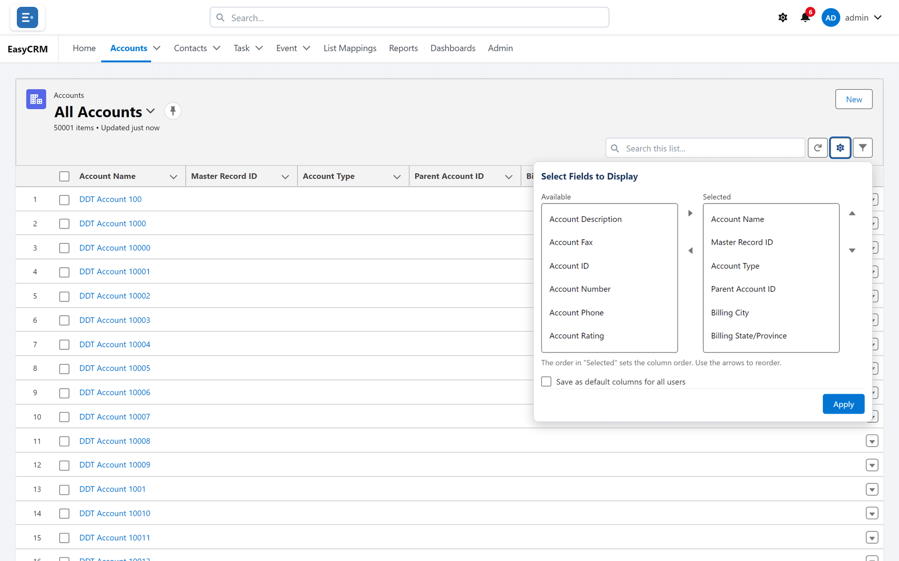
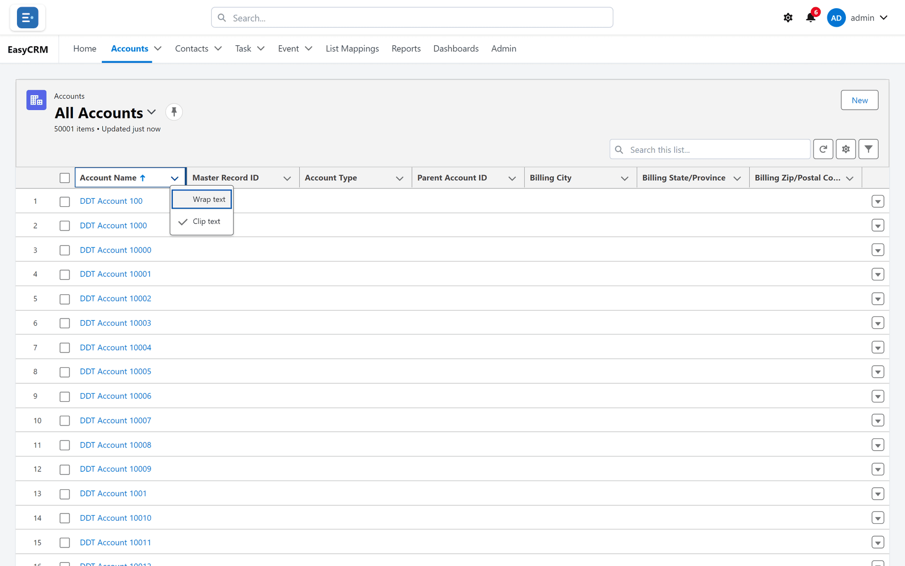

# Choosing columns

You decide which columns a list shows.

1. Click the settings button above the list.
2. Pick fields on the left, and click the arrow to move them to the right.
3. Drag the ones on the right to put them in order.
4. Click **Save**.

The list keeps your choice for next time.

## Column menus

Each column heading has its own small menu for sorting.

