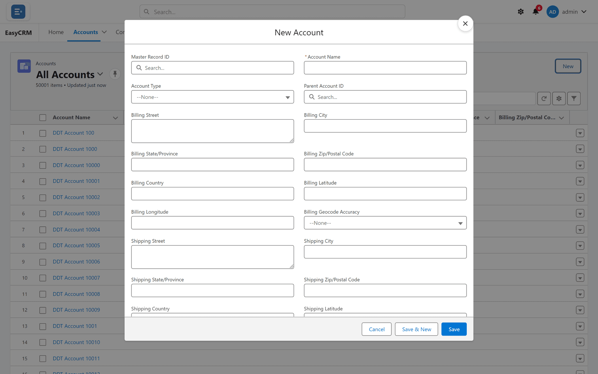

# Adding a record

1. Open the tab you want to add to, such as **Accounts**.
2. Click **New**.
3. Fill in the fields. The ones marked with a red line are required.
4. Click **Save**.

The new record opens.

## Adding several at once

To add a lot of records, use a spreadsheet instead. See
[CSV Import](../administration/csv-import.md). You need to be an administrator.
