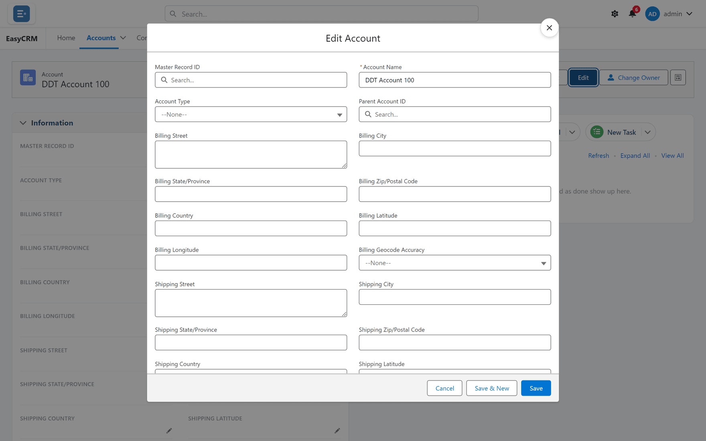

# Changing a record

**What it is.** Changing the information stored on a record.

**What it does.** Your change is saved straight away, and everybody who can see the record
sees the new value.

**Why it matters.** There is no draft and no approval step. When you click **Save**, it is
live for everybody.

## Changing a record

**Where:** **Accounts** → the record's name → **Edit**

1. Click the tab for the kind of record — **Accounts**, for example.
2. Click the record's **name** to open it.
3. Click the blue **Edit** button at the top right.
4. The fields become boxes you can type in.

   

5. Click into any field and change it.
6. Click **Save** at the bottom.

To abandon your changes, click **Cancel**. Nothing is saved.

## Changing one field quickly

You do not always need **Edit**.

1. Open the record.
2. Hover over the field you want to change. A small pencil appears on its right.
3. Click the pencil.
4. Change the value.
5. Click **Save**.

This is quicker when you only need to fix one thing.

## If a field will not change

Some fields cannot be edited. There are three reasons:

| Reason | What it looks like | What to do |
|---|---|---|
| The system works it out | No pencil appears | Nothing — it updates itself. |
| You do not have permission | No pencil appears | Ask your administrator. |
| The record is read-only to you | **Edit** is missing | Ask your administrator. |

Which one it is comes down to [permissions](../administration/permissions.md) and
[sharing](../administration/sharing.md).

## If Save shows an error

A message appears naming the field that is wrong. The usual causes:

- A **required** field is empty. Required fields have a red line on their left.
- A date, number or email address is in the wrong format.
- A value is not one of the allowed options.

Fix the field the message names, then click **Save** again. Your other changes are still
there — nothing is lost.
