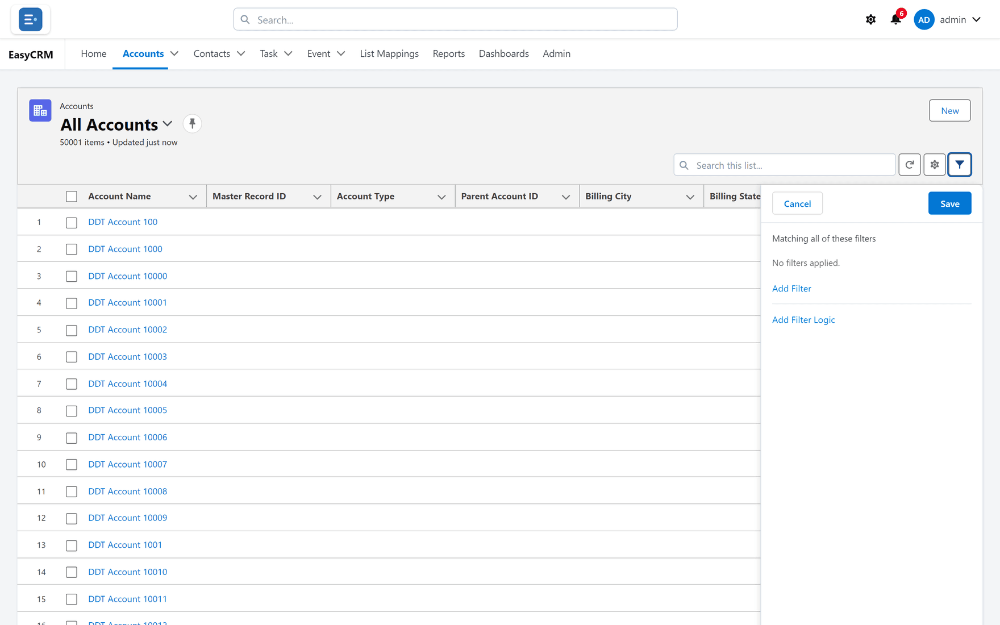

# Filtering a list

**What it is.** Rules that hide the records you are not interested in.

**What it does.** Only records matching your rules stay on screen. Nothing is deleted — the
rest are just hidden from this view.

**Why it helps.** A list of fifty thousand records answers nothing. A filtered list of twelve
answers a question.

## Adding a filter

**Where:** **Accounts** → the filter button (top right of the list) → **Add Filter**

1. Click the tab for the records you want — **Accounts**, for example.
2. Look at the three small buttons above the table on the right. The last one, shaped like a
   funnel, is the filter button. Click it.
3. A panel opens on the right.

   

4. Click **Add Filter**.
5. Choose three things:
   - **Field** — what to look at, such as Billing City.
   - **Operator** — how to compare it, such as "equals" or "contains".
   - **Value** — what to compare it to, such as London.
6. Click **Save**.

The list now shows only matching records, and the count at the top changes.

## Using more than one filter

Add as many as you need, the same way.

By default a record must match **every** filter. Two filters means both must be true.

## Changing that with filter logic

**Where:** the filters panel → **Add Filter Logic**

Each filter has a number — 1, 2, 3 — in the order you added them. Filter logic lets you
combine them differently.

1. Click **Add Filter Logic** at the bottom of the panel.
2. Type a rule using the numbers:

| Rule | Means |
|---|---|
| 1 AND 2 | Both must be true. This is the default. |
| 1 OR 2 | Either will do. |
| 1 AND (2 OR 3) | Filter 1, plus either 2 or 3. |
| 1 AND NOT 2 | Filter 1, but not filter 2. |

3. Click **Save**.

Brackets work the way you would expect from arithmetic.

## Removing a filter

1. Open the filters panel.
2. Click the small cross beside the filter.
3. Click **Save**.

To clear everything at once, remove each filter, or switch to a different list.
