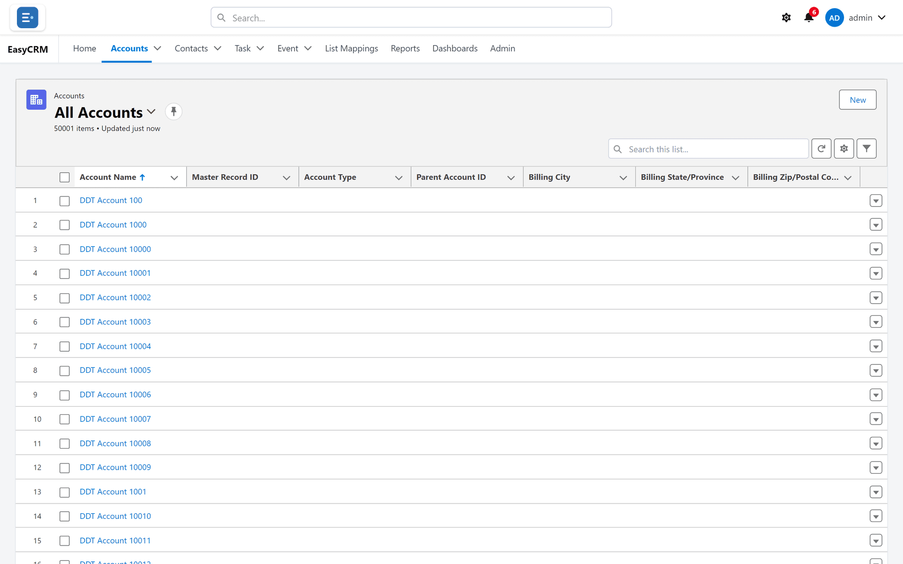
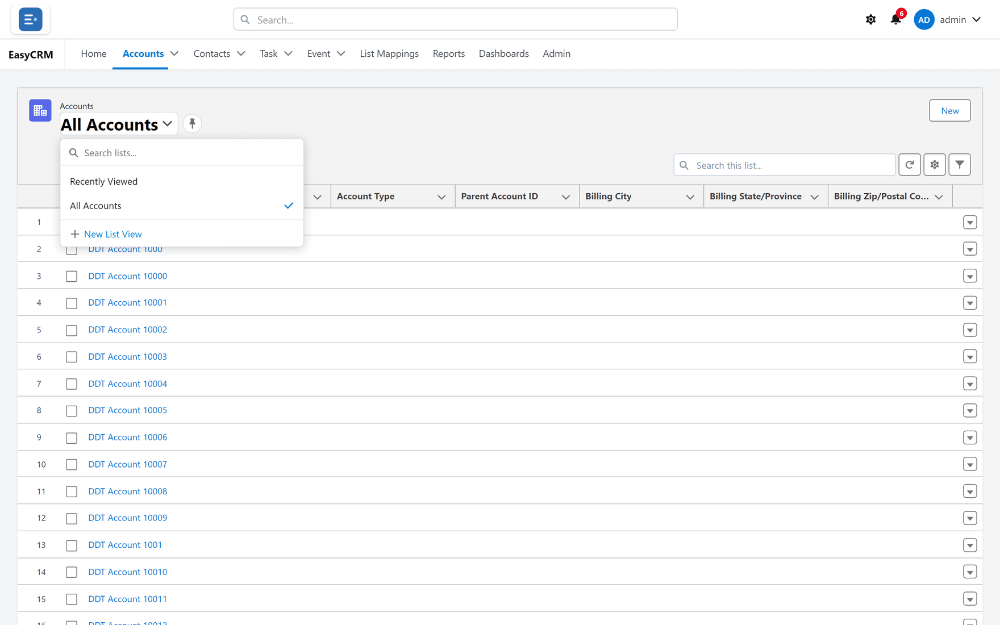
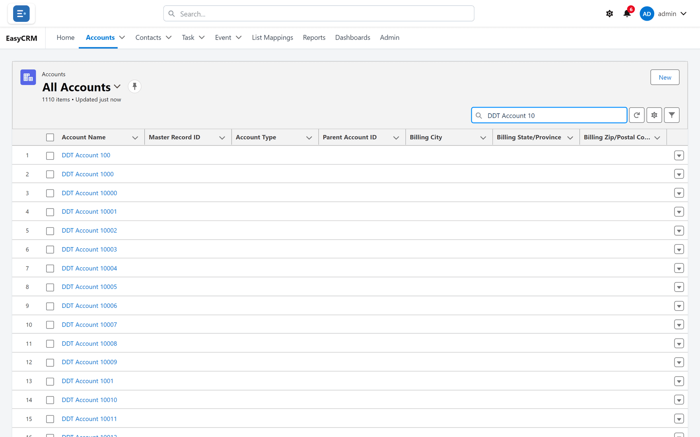
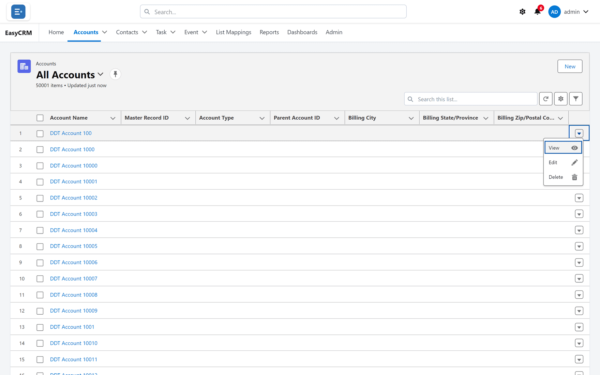

# Looking at a list

Click a tab — **Accounts**, **Contacts**, **Task** or **Event** — to see a list of records.

The bar at the top tells you which list you are looking at and how many records are in it.

## Switching list

**Recently Viewed** is what you opened lately. There are usually other lists to choose from.

1. Click the list name at the top.
2. Pick a list.

To make a list open by default, click the pin next to its name.

## Searching inside a list

Type in **Search this list...** to narrow it down.

## Acting on one row

Click the arrow at the end of a row for the things you can do to just that record.

## Sorting

Click a column heading to sort by it. Click it again to reverse the order.
