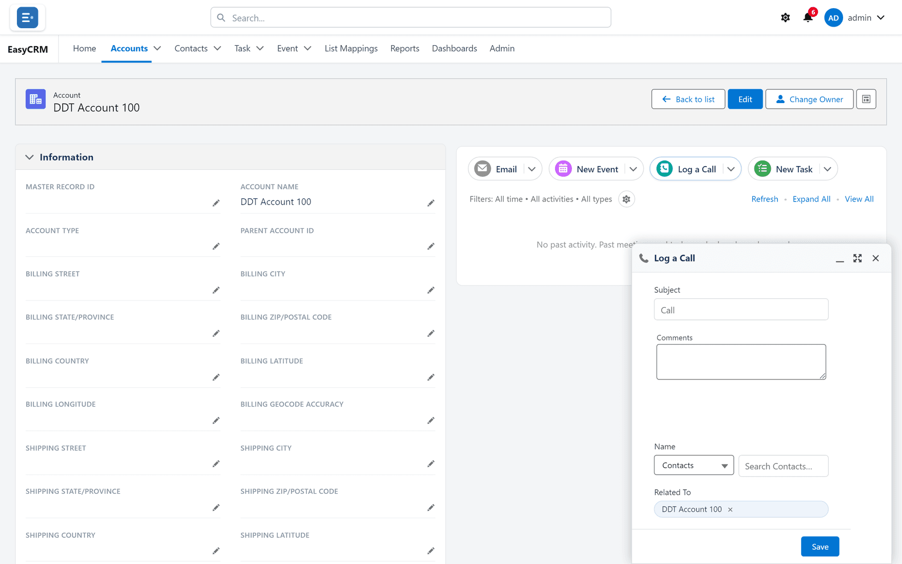

# Opening a record

Click a name in the list.

The record page shows the details at the top, and related information below.

| Section | What it holds |
|---|---|
| **Details** | The fields on this record. |
| **Activities** | Calls, tasks and meetings. |
| **Files** | Documents attached to this record. |
| **Related** | Other records linked to this one. |

Blue text is a link. Click an email address to write an email, a phone number to call, or a
linked record to open it.

## Going back

Use your browser's back button, or click the tab name at the top.

## Adding a call, task or event

The panel on the right is where you record what happened.

1. Click **Log a Call**, **New Task**, **New Event** or **Email**.
2. Fill in the details.
3. Click **Save**.

What you add stays attached to this record, so anybody who can see the record can see it.
