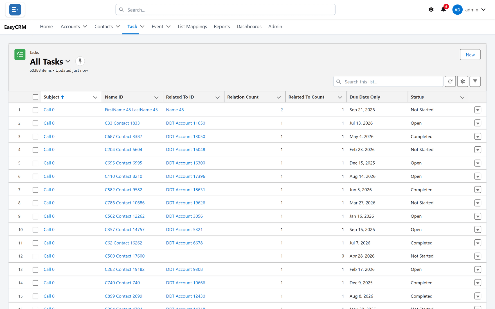
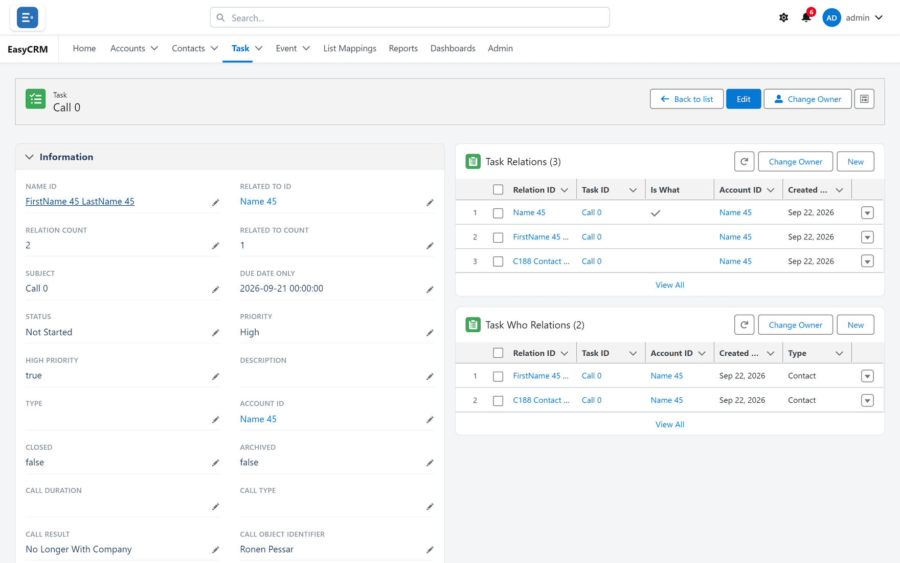
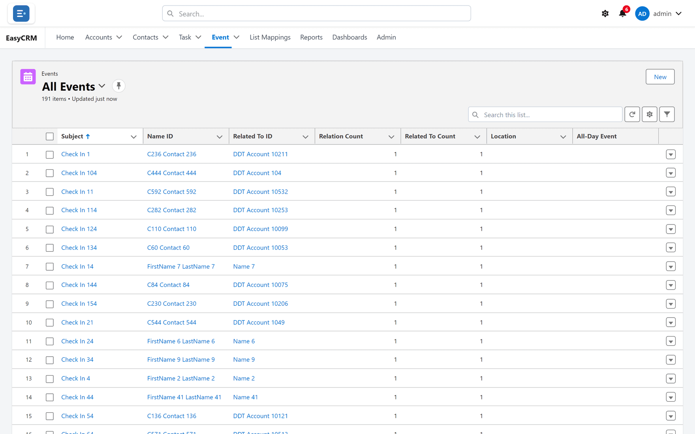
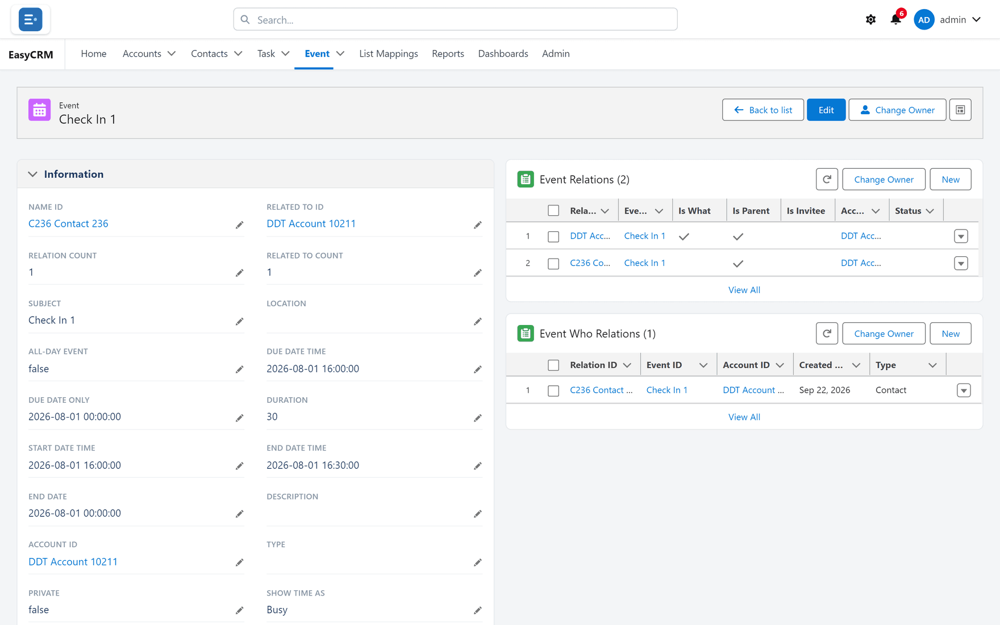
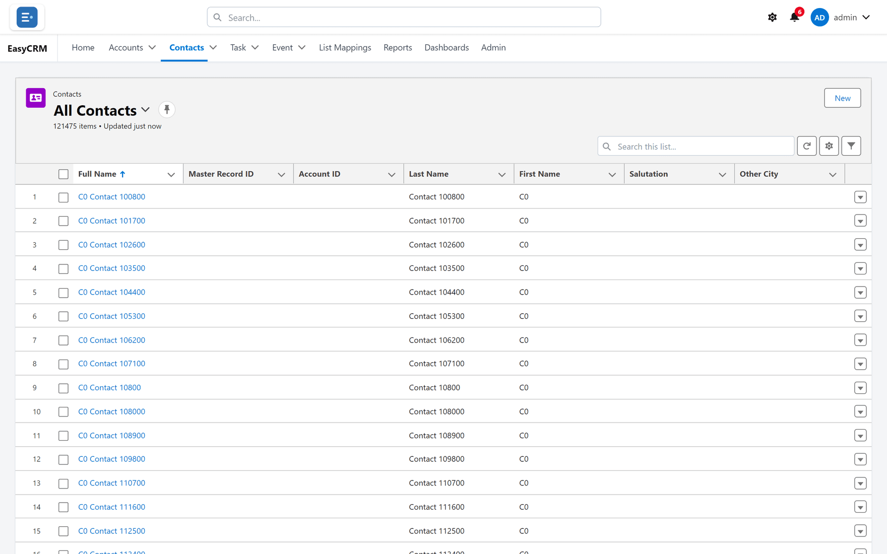
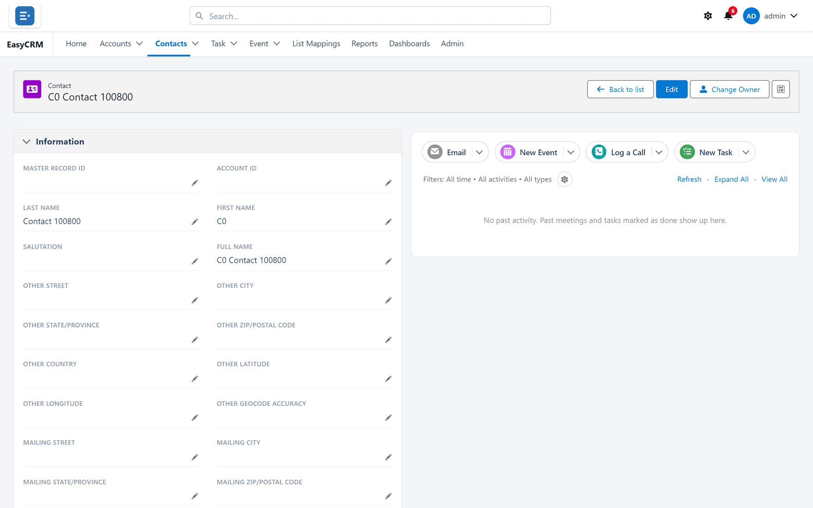

# Tasks and events

**What they are.** A **task** is something to do. An **event** is something in the diary, with
a start and an end.

**What they do.** They sit against the record they concern, so the next person to open that
customer can see what has happened and what is due.

**Why they help.** Follow-up stops living in one person's inbox or memory.

## Seeing your tasks

**Where:** **Task** in the top menu

1. Click **Task** in the row of tabs at the top.
2. The list opens. If it is empty, switch to the **All ...** list — see
   [Looking at a list](./lists.md).

Your open tasks also appear under **My Tasks** on the home page. Anything past its due date is
marked **Overdue** in red.

## Opening a task

1. Click the task's **Subject** — the blue text in the first column.

2. To mark it done, click **Edit**, change the status to **Completed**, and click **Save**.

## Seeing your events

**Where:** **Event** in the top menu

1. Click **Event** in the row of tabs at the top.
2. The list opens.

3. Click an event's **Subject** to open it.

Events in the future also appear under **Upcoming Events** on the home page.

## Adding one against a record

This is usually the better way, because the task or event stays attached to the customer it
concerns.

**Where:** **Accounts** → the record's name → **New Task** or **New Event**

See [Calls, tasks and meetings](./activities.md) for the full steps.

## Contacts work the same way

**Where:** **Contacts** in the top menu

Click a contact's name to open it. A contact has the same shape as an account — fields on the
left, activities on the right, related records at the bottom.

